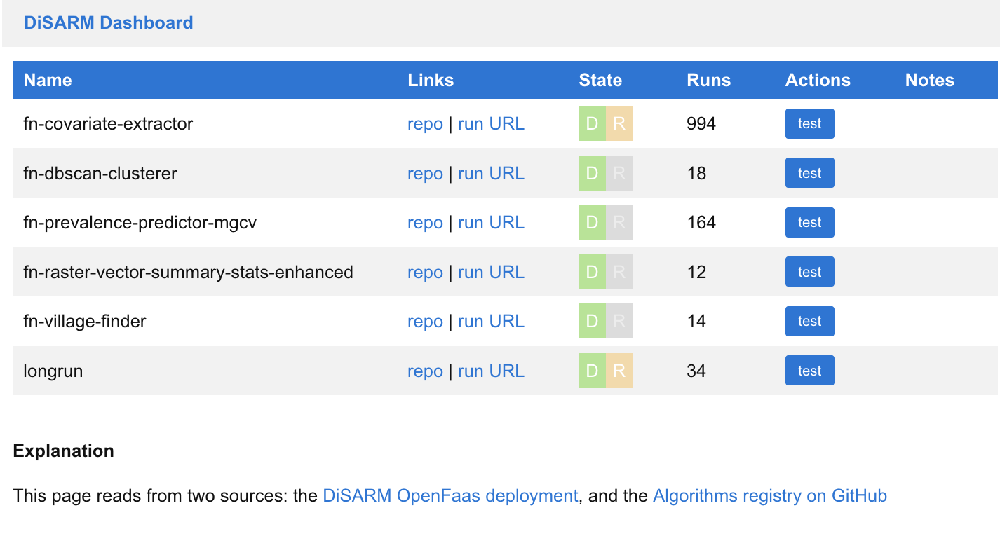
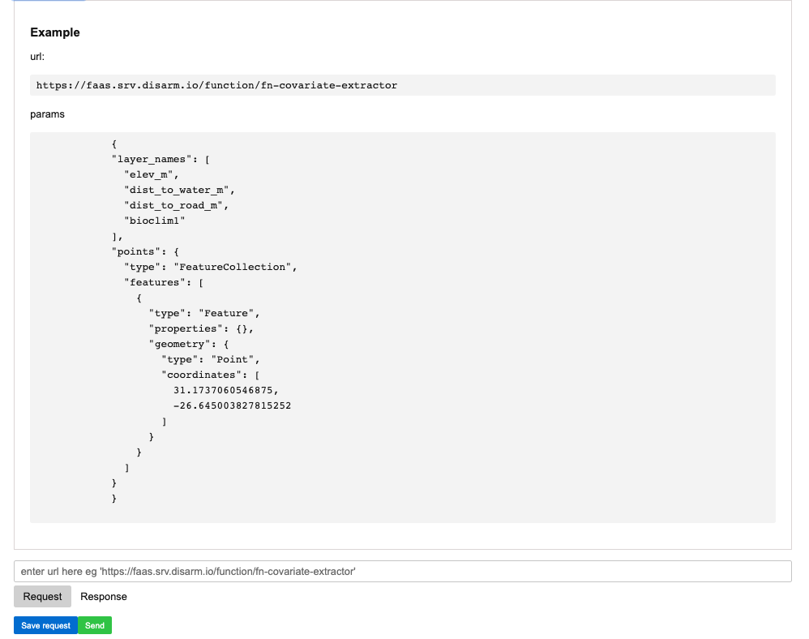

# DiSARM API Infrastructure

_For a very quick-start, watch a_ [_real-time walkthrough_](https://youtu.be/67HUwyt3PoA) _of creating an infrastructure from scratch, using Docker Playground, OpenFaaS and a new \(simple!\) function from a template \(12_ minutes\).

We use three main open source components in the DiSARM API infrastructure:

* [OpenFaas](https://docs.openfaas.com/) - Functions-as-a-service platform
* [Portainer](https://portainer.readthedocs.io) - container management
* [Traefik](https://docs.traefik.io/) - reverse proxy to handle routing

Configuration is documented and described in the [`disarm-faas-docker`](https://github.com/disarm-platform/disarm-faas-docker) repo, in both the README and [the wiki](https://github.com/disarm-platform/disarm-faas-docker/wiki).

### Dashboard

We have also built a dashboard for monitoring and running the deployed functions, with instructions for installing this. This is not necessary for deploying and running algorithms, but does provide some useful functionality including quick testing and monitoring numbers of calls. [Full details in the repo](https://github.com/disarm-platform/disarm-api-dashboard/).

The dashboard is also provides a simple interface for running any deployed algorithm.

