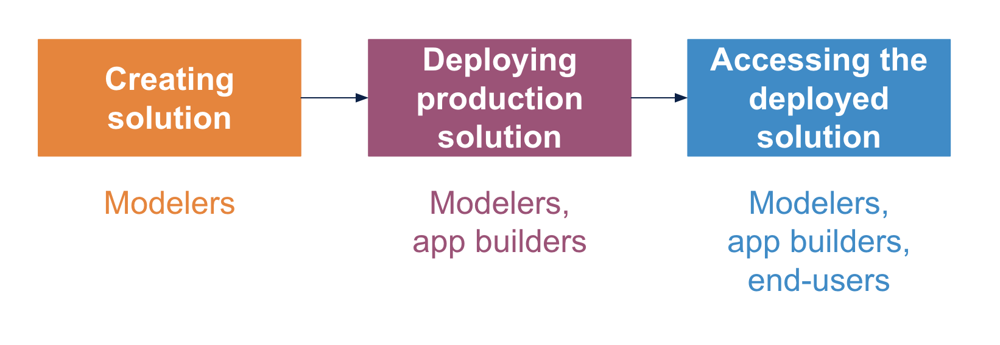

# Creating and deploying algorithms

## Note on terminology

We use _function_ and _algorithm_ interchangeably, to describe any piece of code which can be packaged and deployed, and performs a specific task or process.

The following documentation is designed to support the creation and deployment of algorithms written in R or Python. If you just want to deploy one of the \[existing DiSARM algorithms\], you can jump straight to the section on [Running algorithms](https://docs.disarm.io/api-docs/using-the-api).

Watch a [real-time walkthrough](https://youtu.be/67HUwyt3PoA) of creating an infrastructure from scratch, using Docker Playground, OpenFaaS and a new \(simple!\) function from a template \(12 minutes\). Note that this video is designed to give a brief overview of the process but is not designed to be the main support tool for creating and deploying algorithms. For this, refer to the next sections.

The figure above shows the main steps and actors for involved in the process of creating an algorithms-as-a-serivce tool

