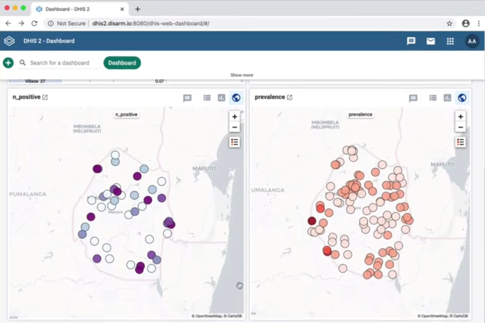

# DHIS2 integration example

Using the API approach, algorithms can be accessed from external applications. We demonstrated this by integrating with [DHIS2](https://www.dhis2.org/).

As an example use-case, we predict disease prevalence at locations from a survey, using a DiSARM algorithm which predicts prevalence based on climatological and environmental data. Using a DHIS2 app, we send survey data and locations from a sample of health facilities to the DiSARM algorithm, which estimates prevalence for all health facilities. The results are mapped and charted inside the DHIS2 dashboard.

This is fully-documented here [https://github.com/disarm-platform/dhis2-integration](https://github.com/disarm-platform/dhis2-integration), including example code and scripts. You can also watch the [overview video](https://youtu.be/osnsxEW3F2k).

## How does it work?

The integration demo is presented as a simple DHIS2 application. It is installed using the DHIS2 app manager, and available to users within the DHIS2 interface. The application extracts data from a running DHIS2 instance, posts to the DiSARM algorithm service, and updates the DHIS2 instance with the result.

The integration code is run on a remote server, to avoid memory and processing constraints, and to reflect the most likely use-case. However, with small amounts of data \(e.g. hundreds of points, as with our demo data set\), this could be run within the DHIS2 application in the browser itself.

The algorithm is run on DiSARM's API.

The majority of the integration code is concerned with reshaping data. The code to send the data to DiSARM algorithm for processing is only a few lines.

The main steps the integration code runs through are:

1. Extract data from DHIS2 tables
2. Reshape the extracted data into GeoJSON, e.g. combining `orgUnit` locations with survey values
3. Send the data to DiSARM algorithm, wait for response
4. Reshape the algorithm result data back into a format ready for DHIS2
5. Post the reshaped result back into DHIS2

