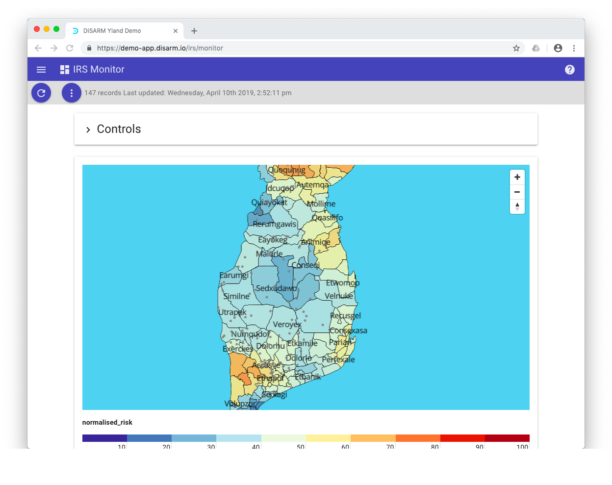
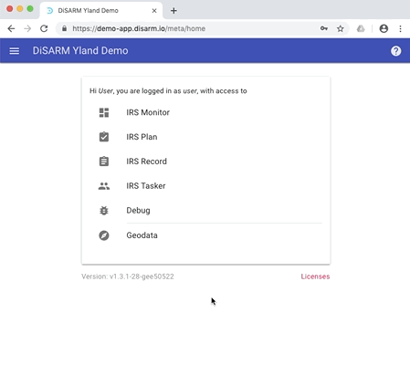
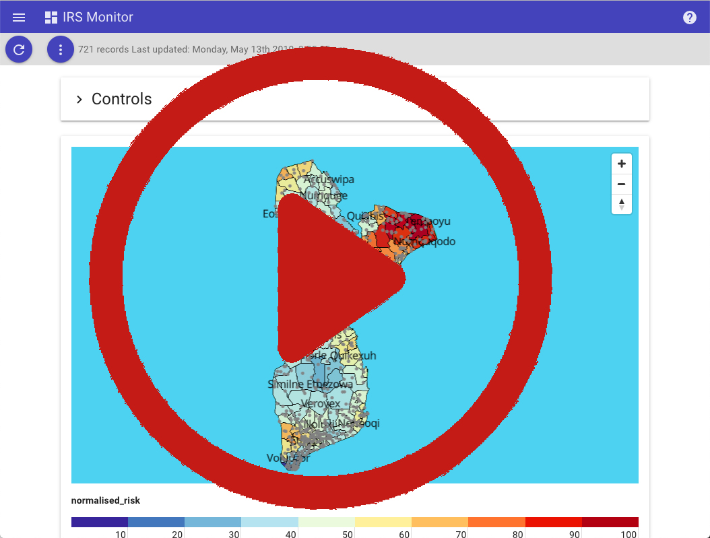

# App: Demo

## Introduction

The DiSARM application has version that has been deployed for demonstration puporses. All the modules of the DiSARM application have been made available to anyone who would like to try out the application.

> Note that this version cannot be used for actual spray tracking activities, it is only for demonstration purposes.

## Access details to demonstration app

Link: [https://demo-app.disarm.io](https://demo-app.disarm.io)

* username: `user`
* password: `m`

Once logged in the user page will be displayed and this is a menu from where you can start exploring the DiSARM application. For a guide consult the application manual [here](./)

## Creating fake data

The DiSARM application has an option to create fake data very quickly on the debug module. The steps are listed below:

1. Visit debug
2. Click on "Crete fake data"
3. Enter desired number of areas to get randomly 0, 1, 2 or 3 records from each location also picked randomly from the provided geodata
4. Visit the IRS Record module
5. Click options
6. Select synch to upload
7. Then records can then be retrieved and viewed on the IRS Monitor monitor  

or follow the steps executed in the video below:

## Screencast

The [video below is a screencast](https://www.youtube.com/watch?v=aOSJMg_omIA&list=PLjdoHmpUzEOfHg_WCs9UBFJYdvs1DWKHQ&index=2&t=0s) of the DiSARM application in use.

There is also a [playlist](https://www.youtube.com/playlist?list=PLjdoHmpUzEOfHg_WCs9UBFJYdvs1DWKHQ) available of the complete set of DiSARM application and API walkthroughs.

## Previous hosted production versions

The project previously provided hosted versions of the DiSARM app. These have now been retired. If you arrived here by visiting an app URL, please contact your country programme for more information, including about data backup.

