# Login, download, etc

## Login

Open a Google Chrome browser.

> Note: The DiSARM application may not function properly using other browsers.

Enter the URL for your DiSARM application. This will be provided by the person who sets up the DiSARM application for your organisation.

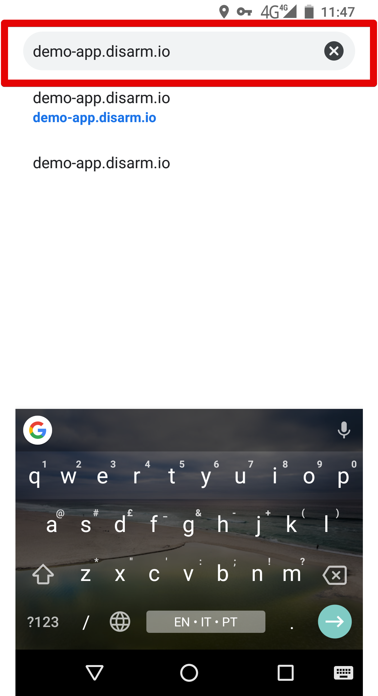

Enter your username and password in the login page and click "Login." If you do not have a username and password, contact your superiors.

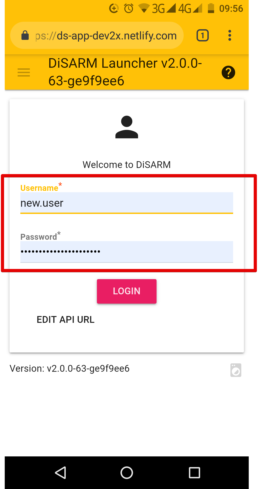

The login button becomes red \(activated\) which means it can be used to log in once login details have been entered in the text fields.

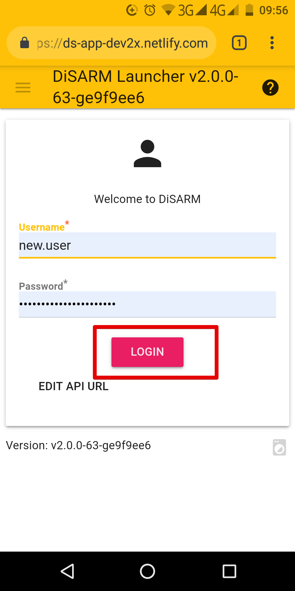

The API URL might need to be checked to ensure that it is correct. To edit that click on the "EDIT API URL BUTTON"

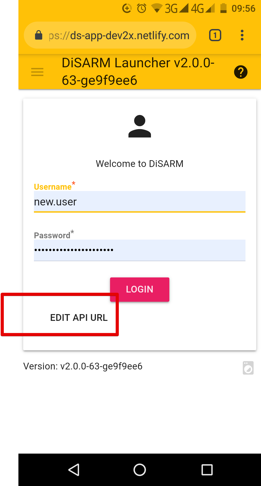

A text filed with the API URL will be shown and the user can edit the API URL there to ensure it is correct and then click the log in button to log in.

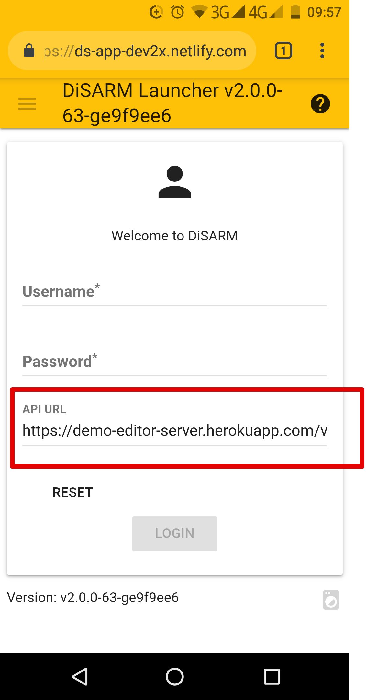

If the login details are wrong you will be shown a message in red saying "User with this login or password is not found".

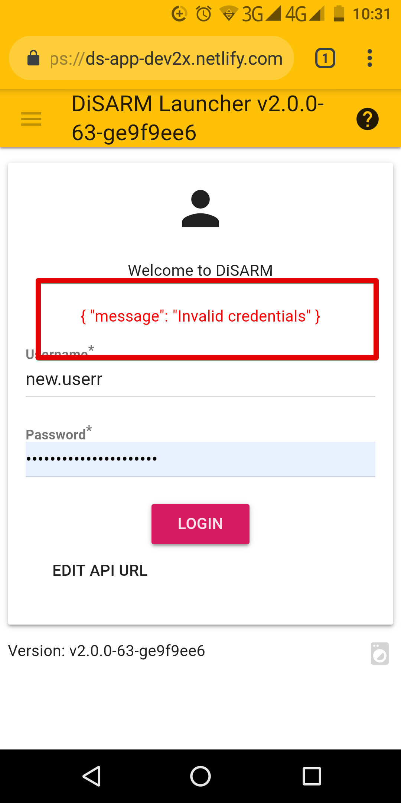

Once you are logged in you will see welcome test with your username, below it will be a list of instances that you have acess to. to acess one click on it.

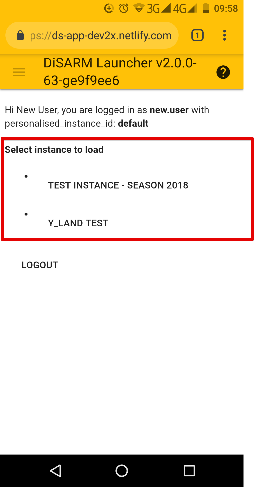

## Logout

Open the sidebar by using the sandwich button on the top right corner of the screen and click on the "Return to launcher" from the options presented.

> Note: If you log out while you are offline, you won\'t be able to use DiSARM again until you login \(which you can only do if you\'re online\).

on the launcher page the user can then click the "log out button" that is below the list of instances to log out. 

## User Page

The first page you will see after clicking the "login"After logging button is the User Page. It lists the sections of the application you are allowed to access pre-selected by your application administrator. These sections are sometimes referred to as modules and a user who has full access will have:

* IRS Monitor
* IRS Plan
* IRS Record
* Debug
* Geodata

> Note: Some application modules will have customized names and a higher or smaller number of modules based on the configurations of your application administrator.

Below the list of modules the text text shows your the version number of your application. When clicked it displays the version number of your configuration and some more device information that includes your browser name, version, operating system and your device name.

## Sidebar

After logging into the DiSARM application, you can view your modules in the sidebar. These modules are the same as those listed on the User Page and are pre-selected by your application administrator. To open the Sidebar, click the sandwich icon \(three small horizontal lines icon\) on the top left corner of the screen.

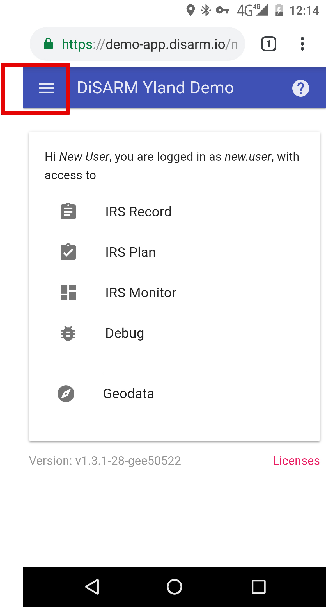

The Side Bar will display the following information:

* Title given to you DiSARM application
* Version of the DiSARM application being used
* Instance ID \(also referred to as testing ID is set during log in so that testing data and settings are not saved with real data\) _not always there_
* Modules made available by your application administrator
* User Page navigation option
* Help option
* Return to launcher

Close the Sidebar by clicking anywhere outside of the Side

## System requirements

The system requirements listed below are fully supported by the DiSARM application.

### Mobile Phones

* Operating System must be Android or IOS
* Browser must be Google Chrome from version 40 upwards

### Computers

* Operating System must be Windows or Mac
* Browser must be Google Chrome from version from version 40 upwards

> Note: Although other browsers my work, we recommend using google chrome as Chrome is fully supported. Other functions may not work well on other browsers.

### Memory usage

A mobile phone must have at least 20 MB of storage free to open and download the application on the browser.

## How to download DiSARM to mobile phone/tablet

To access the DiSARM application your application administrator should give you a web address \(URL\) where your application can be accessed. DiSARM is most compatible with Google Chrome browser

### Automatic pop-up

The application will pop up a message; "offline ready" once it is finished loading. At the bottom there will also be a message: "ADD TO HOME SCREEN". To download the application to your mobile phone click the message.

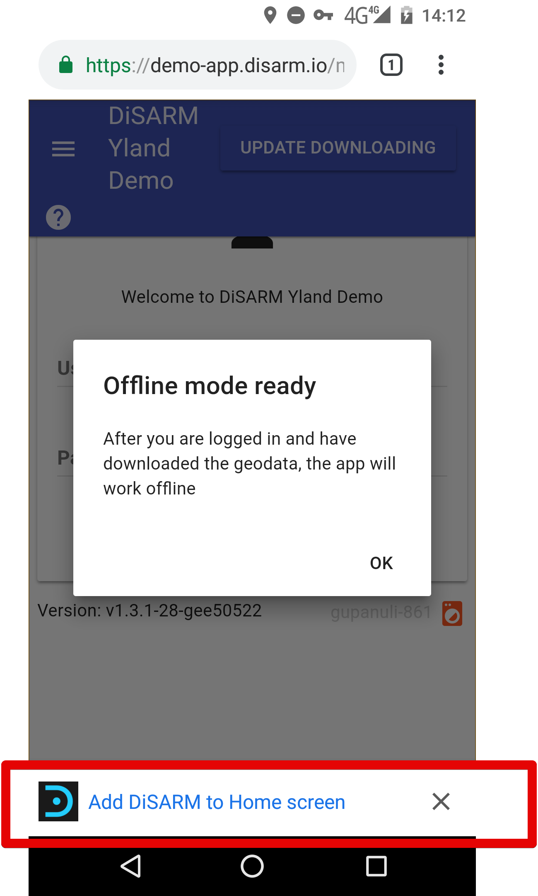

A confirmation message will pop up and you should click "ADD" to download the application, or cancel if you want to keep using the Google Chrome whenever you are using DiSARM.

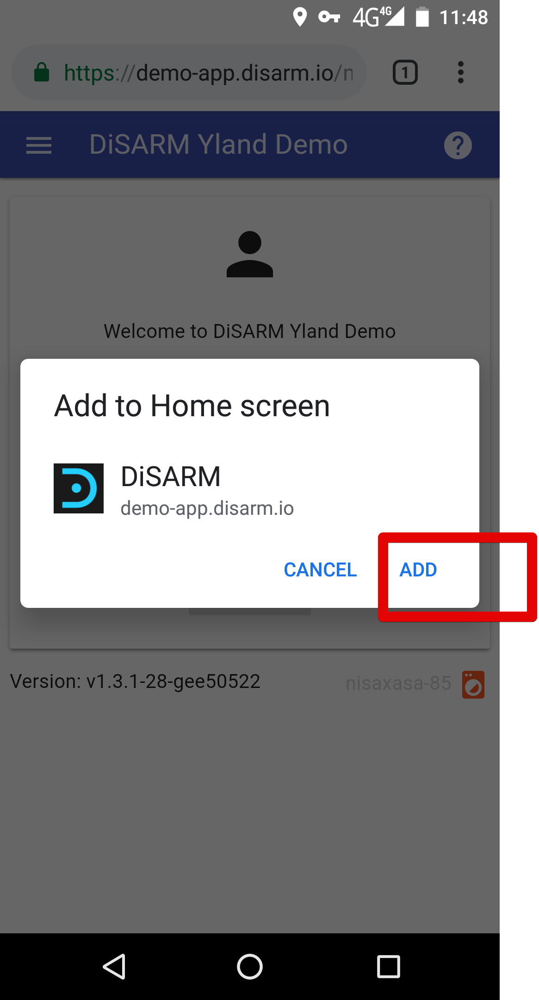

When the application has been added to your homescreen, you will receive a notification saying "DiSARM added on home screen". You may get a different name, depending on what name your application administrator gave the application when they deployed it for your organisation.

### Manual method

If you do not get the pop "ADD TO HOMESCREEN", you can add the application to your home screen manually by selecting the "Options" button on the top right of your browser.

Click "Add to Homescreen" to download the DiSARM application and follow the step number 3.

After clicking "Add," the system will start downloading the DiSARM application to your device. When the download is complete, you will receive a notification on your browser and on the notifications bar at the top of your device.

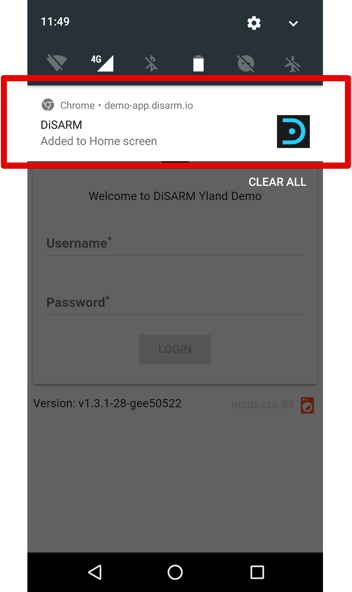

A DiSARM icon will show on your device among the other application icons as shown in the image below:

> Note: If you are on a desktop, the downloaded application is saved in your browser automatically. DiSARM can now run offline on your browser after it has been downloaded.

