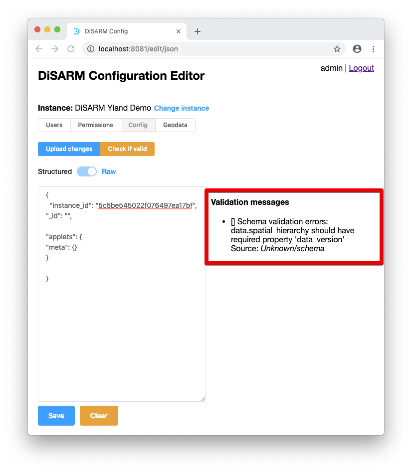

# App manual \(v2\)

## Introduction

This document is written for the user of the DiSARM application who has the authority to make changes to the application that has been deployed. It details how to create a DiSARM version, then create users, give them permission, set up the sections/modules of the application desired and manage geodata.

## Requirements

This is a list of the technical resources and knowledge you will need to have to be able to set up and manage the DiSARM application.

## Required resources 

1.  Link to the application editor
2.  Link to the application front end
3.  Geodata file(s)

## Required skills 

1. Some knowledge of JavaScript programming language
2. 

The items listed above will be discovered below what they serve. The steps below will illustrate how start from the resources listed above to a point where the DiSARM application is ready to be used by multiple users.

The architectural structure of the DiSARM platform is closely related to the three domains. It is made up of the application itself, the editor and the Application Programming Interface \(API\). the application consists of the GUI the users interact with, the editor is the User Interface the administrator user uses for making changes to the application and the API are the function and procedures making the computations and connecting the application with the database where the data is stored.

## Log Into your DiSARM app editor

1. To login to the disarm editor the user must go to the link that you set is provided by the person who deployed disarm for your DiSARM editor. The login page looks like the one shown in the image below. The user must make sure that the API URL is correct by clicking on "Edit API URL"(is also supplied by the person who deployed DiSARM).


1. After clicking the edit API URL button a textfield will be shown where there will be the current API URL shown. The user can change that if it is not the one they set in the second step of this document


Once you click the login button has been clicked the screen that comes next is one where the user can select or create a DiSARM instance. The word instance in this case refers to the deployed DiSARM application for an organisation. The concept of Instances can be used to separate data in case of different spray periods/seasons where the data should not be mixed.


### Create your DiSARM instance

3.  To create a DiSARM instance the user must click the "add new" button as shown below

1. **Create your DiSARM instance**
   1. To create a DiSARM instance the user must click the "add new" button as shown below


1. After clicking "add new" a text field labeled new instance will be shown and that is the user can enter the name of the instance.


1. The user can have a new instance by typing the name and clicking on save.


1. By doing so you should have a new instance in your list of instances and its ID which is generated automatically by the system.


1. If you have more than one instances they will all be shown in the table under the heading;"List of instances". At this stage the instance has only a name and an ID. It is missing users, their permission, configuration and last but not least, geodata. To add these you click on select in the middle colunm of the instance that you want to edit.


1. After selecting an instance, if it your first time opening it on the editor you should see a screen like the one shown below. It displays the name of your instance, a link to changinging the instance, and a menu of editions you can make in a tabs layout


1. Write your configuration file
   1. The configuration file is where the user will add the charts of the dashboard, the form for data collection, add validations, add applets to use and edit them as desired. To access the configuration section the user must click on the 'config" tab on the menu


1. The user will then presented with a structured view of the config. In this context structured view means that the configuration file is divided into the sections shown on the left \(Spatial Hierarchy, Map Focus, Meta, Monitor, Plan, Record \(point\), Tasker, Form, Aggregations, Decorators, Validations\). By selecting one of the sections you get to edit code that concerns only the selected section.


1. When a section is selected it will turn blue and it will be displayed on the top of right column in bold black text


1. The structured config editor makes editing easier because; aside from structuring the whole config file into sections it allows you to insert blank or empty json objects. The user can click on the "insert blank" button as shown below


1. Clicking the "insert new blank" will create the minimum needed code for that applet. It puts in some random text so the user has to change to show what is desired on the app.


1. The user can switch to the raw view to type everything from scratch by clicking the switch at the top that has the label "structured" on the right and the label "raw" on the right


1. If the user goes straight to the raw view of the config after logging in they will be presented with a screen that will have only the instance ID object.


1. The Structured view can work as a guide telling the user what code to add to the config file to complete it step by step. All the user needs to do is add some jason, click on "save" and then click on "check if valid"


1. If the user is not sure how to start, clicking on check if valid will print a message on the right to tell you what is missing.


1. The message above say the missing property is \_id, instance ID is there but the system expects it to be called \_id and not instance\_id. So the use must change it to \_id and click on the save button and then on the "check if valid" one.


1. This presents a new validation message


1. To solve it the user needs to create a property called applets as shown below:


1. The next error is shown above on the right in the image. It requires that we add another property: \_id. After adding something always click the save button and the "check if valid button". The image shown below has the \_id property added and the error message displayed after clicking save and check if valid.


1. The error message above states that Data applets requires a property called meta. So we insert that save and check if our json is valid and fix the error message:



1. The next property to add is a property of the data.spatial\_heirachy and its called data\_version. So this means the config editor needs to have spatial\_heirachy and then have the data version. The image below shows the insertion of both properties and then the results of saving and checking the JSON is valid:

> Note: The version should match the one you have defined in your geodata file.
>
> 

1. The next thing to add is in the same place as the previous step, spatial\_heirarchy and it is the levels property. In the image below it is shown that the expected property of levels is an array but the square brackets. Note: The value comes from the levels that you have on your geodata file.


1. The next property to add according the validation message is markers under spatial\_heirarchy. The image below shows the addition of the of the markers property. Note: Sometimes we have to add commas to at the end of the property lines to keep the rules of writing in JSON. It is for that reason that commas after the data version and levels were put.


1. The next property to add are the denominator fields under spatial\_heirarchy inside markers, Note that these values come from your geodata file too:


1. The validation messages requests for the addition of planning\_level\_name inside markers too. Note that a comma was added at the end of denominator\_fields to keep the config file valid JSON:


1. The next required property is record\_location\_selection\_level\_name. The image below shows the addition of record\_location\_selection\_level\_name property and the next validation message


Since the image is not clear below the image shows how to add the record\_location\_selection\_level\_name


And the validation message is shown in the image below: 

1. Which means the next to add is to add values for the properties listed above. The validation messages states that we need to first include the geodata\_summary summary array inside spatial\_heirarchy

> second; add value for record\_location\_selection\_level\_name property which is called locality, and
>
> third add inside the denominator field a field from the geodata that will be used as a denominator for calculating spray coverage. Which means it should the number of structures inside each area. In the geodata used in this example the file is called NumStrct field locality inside markers, and inside denominator\_fields. Forth and last; We had to also add the property of "name" with "locality" inside the levels array as it is shown in the image below:


1. The validation message requires that we add a property called "display\_field\_name" under the "spatial\_heirarchy" property inside the "levels" array. The image below was taken after adding the "display\_field\_name" property, clicking save and clicking check if valid:

> _Note: that the value OBJECTID comes from the geodata file._
>
> _Remember to add commas to the existing property above when adding another property in the same level below it._


1. In the same place, the "field\_name" property is required, the image below was taken after adding it and checking if config is valid:


1. The next property required is the geodata\_summaries. It is the array "geodata\_summaries" : \[\], and it is not recognised because we are missing the id of the geodata. The geodata is uploaded on the next section \(Section 4\) of this document. The geodata is shown on this screen of the geodata section:


1. 
2. The next step is adding the modules that you want your application to show to your users. In this step you add all of them, you will allow permissions for after creating them. The modules should be placed in the aplets level of the config file. The list of modules that can be added are: Monitor, Planner, and data collector \(record\). In this example the modules added first are the monitor and planner:


1. The validation message requires the addition of the charts propoerty inside irs\_monitor which we added above. In the image below charts is added and the next validation message is shown. Note that charts is an array:


1. And the validation message shows that we need to add the property of "map" inside irs\_monitor. The image below shows the validation message after the addition of the "map" property


1. The next thing to add is the aggregation\_names property inside the "map property which we just added in the step before". This is are the names that will be shown below the map for the user to choose which layers they want to display on the map.Note that it is an array.


1. The next property to add is "bin\_by" which is used to differentiating records points from each other when they are shown the map \(stated by the value location.selection.id\).


1. The validation message shown in the image above requires the addition of a property called property\_layers inside 'map'. We add it in the image below and check for if json is valid, note that it is an array:


1. With the "property\_layers" array added, the next thing required is the response\_point\_fieldswhich are also inside the "map" property. This is shown on the monitor when you click on a response point so you can choose any piece of data from the data collection form for its value \(the value is the one after the ":" and for this example the value is "recorded\_on"\) and it does not have to be only one field.


1. The validation message requires the addition of season\_start\_dates. Values do not have to be added here but if the user's spraying project requires them they can add as many as they want. The application requires start dates only, the application will set the finishing date to be the day before the next season start date. This should added inside the "irs\_monitor" property and four dates are added as the image shows below:


1. The next requirement is of the "table" also inside "irs\_monitor". In the image below the "table" is added and we check the validation message to see what is required next.


1. The "aggregation\_names" property should be added next and that is what the image below shows. The validation message requires that we add the property inside the "table" property that we just added in the previous step and that is because the aggregation\_names will be the headers of the table shown on the monitor.

> For this example the structures spayed and structures sprayed % will be the ones shown in the table. They are all added in the image show below marked out with a red rectangle:


1. The next required property is the "bin\_by" on the "table" to do some filtering of the records when they are collected so that spray percentage can be calculated. The image below shows the addition of "bin\_by" and the next validation message after the addition:


1. Inside the same place \("table"\) the property "propoerty\_layers" is the next thing to be added. The layers to be added is a property for the geodata to show you areas and the label that will show on the table and they are all added at the same time in the image below;


1. The next required property is "table\_ output". This property as stated in the validation message goes in the "irs\_plan". In the image below the property is added and the next error message is shown.


1. To solve the bottom two validation messages which are concerned with aggregation the aggregations must be defined. Aggregations are the calculations we do or numbers we collect to get a total e.g \(total number of structures sprayed, percentage of sprayed structures\). They should be defined end of the "markers" propers as shown in the image below. There are four aggregations defined in our example and they are; structures sprayed, structures sprayed %, bed nets in use and count.


1. The two errors that are left are requiring the addition of the form that is used in data collection because the data is being referred to but the system does not know when and how this data enters the pplication. The form can be genarated easily on a service called surveyjs. Surveyjs, can be accessed here \[[https://surveyjs.io/Survey/Builder](https://surveyjs.io/Survey/Builder), provides a drag and drop interface for the user to create survey forms. While the user creates the form it generates the json of whatever the user has designed so that it can be copied and pasted elsewhere. In this example the json for the form has already been developed using the survey js and will be pasted at the end of the "markers" applet, the image below demonstrates:


Another image showing the other end of the form:


And the complete code of just the form is shown below:

```
{
  "form": {
    "pages": [
      {
        "name": "page1",
        "elements": [
          {
            "type": "text",
            "name": "sprayed_count",
            "title": "Number structures sprayed with DDT",
            "isRequired": true,
            "validators": [
              {
                "type": "numeric",
                "text": "Must be more than zero",
                "minValue": 0
              }
            ],
            "inputType": "number"
          },
          {
            "type": "text",
            "name": "bednets_count",
            "title": "Number bednets in use",
            "isRequired": true,
            "validators": [
              {
                "type": "numeric",
                "text": "Must be more than zero",
                "minValue": 0
              }
            ],
            "inputType": "number"
          }
        ]
      }
    ]
  }
}
```

1. And once there is a validation message that says there are no problems. The configuration file is still incomplete though because there are still more options that can be added to the disarm application. The table on "irs\_plan" applet does not have any items to display. The image below adds the headers for the table and adds the source fields.


1. When the "No probs" validation error shows up it may help to check the whole configure file for some missing values like empty braces. The charts are still an empty array and the next step will be adding a chart. In the image below the chart is given an ID and its dimensions then the validation message will guide on what to add next:


1. The validation messages states that the next required fproperty of the chart is "options". In the image below options is added and the next validation message is shown. The options property comes with the first property, "layouts" in the image. The other options are added in other images:


1. The next required property according to the validation message is the "title" which is supposed to be inside the "layout" property which we just added. The title refers to the titles of the chart that are included in the legend. That means the x-axis label, y- label and the main title of the chart. In this step all three titles are added:


1. The next step is to set to be visible on the screen. This is done by adding a "showlegend" property and giving the value true inside the "layout".


1. The validation message shows there are no problems, but the chart is not complete. The image below shows the addition of the chart type and the one in this example is a line. It could be a bar or pie chart:


1. In the image below the "time\_series" is set to true to plot the line chart against a stipulated time period:


1. To show the records on this chart \(line graph\) we will need to state a value to group them with, and since it is a line that is based on the dates when records are collected the field to be used is "recorded\_on". This field is automatically generated as time stamp and saved when the record is collected. In the image below we add the "bin\_by" property just below the "time\_series"


1. The next thing we add just below the "bin\_by" property is the "geographic\_level\_refactor\_this\_key\_name" property and its value is "location.selection.id".


1. The next property to add is the "multi\_series" and changes the legend on line graph at the bottom.


1. There is nothing more required but the map property does not seem like it is complete as it missing some values of the properties. There is a couple of empty arrays that need to be filled in. in this example the "aggregation\_names" array is filled in first and the values added as shown in the image below are \"structures sprayed %\", \"structures sprayed\":


1. The "property\_layers" property also has an empty array, so we put values that will be used to paint the map with the layers that the user prefers. In this example the values that will be added will be the risk and layer, and the number of structures layer. They are added as shown in the image below:


1. The "response\_point\_field" property has an array that is still empty. In the image below we add only one value in that value called \"recorded\_on\" to show the date when the record was collected when it is clicked:


1. The map that is in the monitor is of type chart and therefore we must state is its property as shown in the image below:


1. The same applies to the table on the dashboard/monitor. It is also of type chart in the code of the application and therefore it should be identified so by adding the "chart\_type" property inside table{} as shown below:


1. The planner module is also missing a tittle which should be added just before the closing brace of "irs\_plan" as shown in the image below. The title can be any word you want as long as you will remember that it refers to the planning module.


1. The application will also need the "irs\_record\_point" property just below the "title" property that we just added. The image below demonstrates the addition and the validation message shows what more is required


1. As required in the validation message in the image above, the next thing that is added is the metadata property.


1. "Optional\_fields" is the next required property. It is going to be added in the "metadata" brace that was made in the previous step. The "optional\_fields" will be an array that will have fields that the users do not have to fill in when collecting data.


1. The validation message requires the addition of a property called "show" inside metadata. The image below shows how to add that property and it is given the value of true:


1. Before moving to deal with the validation message shown above we will insert a field inside the optional\_fielda array just below the "show" property that we just added. The optional field will be "team\_name"


1. The validation messages shown above require the location selection areas. The user will have to list all of them in an array. They should all be listed in the geodata. For this example in each area the ID, name and category will be listed in the array. First the array will be added in the image below:


1. Next thing to add is the list of areas in the "locality" array added above. As stated in the previous step, each area will have an ID, name and category \(which is a region in which the area is\).


1. At the end of the array it should like it looks in the image below:


1. The next thing to add the debug module. This is a part of the application that can be used for advanced debugging function e.g. automatically generating random records, editing form validations, clearing app data and etc


1. The next property to add is the map focus. This will set the application to focus on your supplied geodata instead of the whole map or a wrong country when the application monitor/dashboard is opened. In the image below it is added without any properties inside, the validation message will state what is required:


1. The validation message requires a property called "center" and it requires two values of latitudes and longitude to show the center of your geodata for the application to focus on. The image below demonstrates the addition of that property and its two values:


1. The validation message then requires the addition of the "zoom" property after adding the center. The zoom property should be added right after the closing brace of the "center" property:


1. Even though the validation messages do not show, but the instance will probably need a title so the users know what they are using on their devices. This title can be named anything the administrator desires. For this example it is named the Y-Land Demo. In the image below the instance property is added and inside it the title of the instance is designed:


1. In the absence of problems in the validation messages the next property to be added will be the "location\_name" and the "slug", both inside the instance property. The location of this name is fictional, the administrator user should put the name of the country or area they will be working in.


1. The next property to add is the "fake\_form". This is added at the end of the configuration file. The "fake\_form" is used in the debug part of the application for generating the random records. It will be an array of values filling in the data that needs to be filled in when collecting a record.


1. Inside the array the user can add as many form values as they want to alternate when generating random data. The user only has to define the data that will be filled in on the form while collecting the data. The application will come up with time stamps and location coordinates for each record point that is collected. In this example three different sets of data are added.


1. The next to add is an array of validations. This array will hold the validation of the form should there be any extra that the user wants to add. It is best to add all of them while generating the form and have them embedded in the form. The validation array added below will then be left empty as shown below:


1. After the validations array, a "presenters" property is added. It will have inside it some properties that will be shown when a response point is clicked on the map in the monitor module. These properties will be inside another property called "pop\_up" description as shown below:


1. Inside the "popup\_description" the fields that will be shown when the response point is clicked will be defined as shown in the image below:


wergwerg

1. The last property to add on the configuration file will be the decorators. They are used to show different colors on the response point on the map. In this example the application will use the default color so the decorators property is left empty. The default color is gray:


1. Geodata
   1. To upload the geodata, select the geodata tab on your configuration editor menu shown in the red rectangle:


1. After clicking on "geodata" the screen shown in the image below will be displayed. It shows that there is no geodata uploaded yet. To start uploading click on the "upload geodata" button that is shown with a read rectangle


1. A form for uploading the geodata. There is a first a space for naming the geodata \(shown with a red rectangle below\):


1. In this example the geodata is named "locality", then we upload the geodata by dragging the geodataIf the file is the right format to be uploaded \(GEOJSON\) the "Upload" button will be activated as shown in the image below.


1. If an error occurs during the upload, a message will be displayed saying "upload failed" and clicking try again will bring the user back to the beginning


1. Once uploaded the list of geodata will be shown and you will be able to click on it to see a small summary of it.


1. The list of uploaded geodata will show the name and automatically generated geodata ID. The image below shows the summary of the geodata which is shown when the user clicks on the geodata name on the list


### Create users

> To create the users who are going to use the application you must access the users part of the application. On this section of the application there is a form to fill in to create each and every user, giving them an ID, name and password. Permissions will be configured in a different part of the application.

1. To access the users section select the "users" option on the menu at the top of the page:


1. The image below shows the display that comes after clicking on users. The display shows an empty table that is supposed to list the users once they have been made. The actions column will show options that can be taken for user e.g. change password, delete user. To add the user the "add new" button shown below is clicked


1. After clicking on "add new" a form is unveiled where the user can add the "name", "login" and "password"

> The name does not need to be unique and it can be the real name of the user depending on your organisations rules. It should be inserted in the field marked red below:


1. 1. For this example a user named tom will be added to the system, given a login of "tom005" and the password will be generated by the application. In the "name" field \(shown above\) the word tom will be inserted.


1. Inside the "login username" field the value will that will be inserted will be Tom005. The user may notice that the field already has the word "tom" in small letters inserted when the "name" field was deselected. To demonstrate that names may not be unique but users have the option to add numbers after the name we will just add "005" after the name. The image below demonstrates the addition of the "tom005" in the "login username" field:

> Note: the name and login username do not have to be the same


1. The next step is to click "save". The generated password will be copied in the next step to send to the user because after clicking save the user's information will be displayed on the screen in a pop up message.


1. The pop message discussed in the previous step is shown in the image below:

> Note: these details must be copied and pasted into another document so that the list of users and passwords is documented


1. If the user clicks OK on the pop shown then it goes back to the table that shows a list of all the users and the actions that can be taken in the management of user:


1. If more users are required the same steps listed above should be followed. Should a user forget their password it can be reset by clicking on the "reset password" button under the "actions" column.


1. When clicked the button will instantly delete the old password and generate a new, and pop up a message with the new password


1. The next session discusses how to give permissions to your users that have been created in this section.

### Permissions management

In this section of the application the administrator will be able to give permission to the users of the application. The applications is divided into sections called modules. It collects these modules \(sections\) from the configuration file written in section 3 of this document and displays them for the administrator to choose if a user can access that section or not.

1. To get to the epermissions sections the option to be chosen on the main menu is the "permissions" as shown on the image below:


1. The next view will show the collection of all the modules that are defined in the config file. The image below shows how the view looks like:


> A more clearer image which is cut in half so that the view is more clear:
>
> 

1. As shown in the image there is a table with the columns being first the username, bulk, irs\_monitor write, irs\_monitor read, irs\_plan write, irs\_plan read, irs\_record\_point write, irs\_record\_point read, debug write, debug read. Next to each of these is all or none option which are used to define if user is given permission or not. The first thing to do though is to select a user that you want to give the permissions to by clicking on the button "add user" on the bottom left.


1. Once clicked the button will pop the list of all the users and the one to be given permissions should be selected by clicking on their name:


1. Since in this example on one user was made the pop list only shows the username of Tom which is tom005. Clicking on it should create a row on the table with plus signs under each column that can be clicked to give the user the permission presented in the header of that column.


1. The image below has two red rectangles on the items that can be clicked to grant permissions to the user. The items are the + sign and the text "All" just below that module that you want to grant permissions of.


1. After clicking the two items shown above the result should look as the one shown below:

> Note: the green checks/ticks mean that the user has access to the modules in which the ticks are in:
>
> 

1. The bulk column can be used if you want to give a user all the permissions in just one click. To do that click on all under bulk and the whole row will be filled with green ticks showing the user has permissions to access every part of the application;


1. To remove permissions the text "None" is clicked the permissions are removed instantly. Another method is by clicking on the green tick and they will be removed and once again the ticks will turn into plus signs. Below the permissions are removed for irs\_monitor read\(by clicking on "None"\) and irs\_monitor write\(by clicking on the green tick\).


1. The last step is to click on upload changes to make sure that the settings you made are saved on your server and are applied to your users when they log in. to upload the changes click on the "Upload changes" button which is shown below:


1. **Test your application**
   1. To test your application visit the link that you used on the 2nd section of this document to link to your DiSARM application. You should be presented with a login form like the one shown below


1. Log in with the details that were made in the 5th section of this document titles create users. The log in username was tom005 and the password was changed to "pillowing-therunder-233". They should be inserted as shown in the image below:


1. Before clicking the login button it is necessary to ensure that the API URL is the one that was set in section 1 of this document. To do that click on API URL and change the text to your own API URL.


1. After editing the API URL to yours click on login and you should see a display like the one shown below where you can choose the DiSARM instance you want to log into or logout \(which takes you back to the login page\). In this case the desire is to log into the DiSARM YLAND DEMO test it so that is what will be selected under the text "**Select instance to load**"


1. The next window shown after logging in requires the user to retrieve/download the geodata. To do that click on "retrieve" as shown below:


1. Once the geodata has been retrieved the read exclamation mark on the left will turn into a green tick/check and the launch button will be activated. Click on the "launch" button to launch the DiSARM application:


1. Once clicked the launch application should make the application display the menu options that the user has been given permission to access as shown in the image below. The last step on the permissions section of this document was to remove the permissions for the user on the irs\_monitor module. So the user "tom" that is logged in now should not see the irs\_monitor module:


