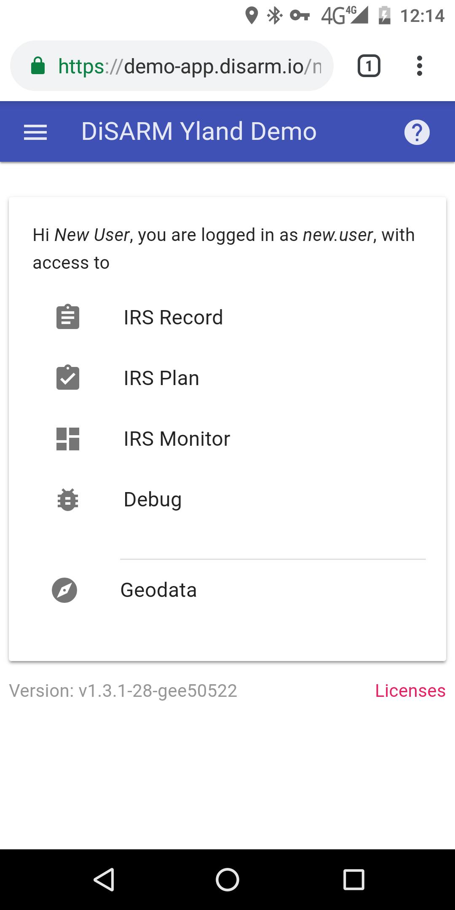
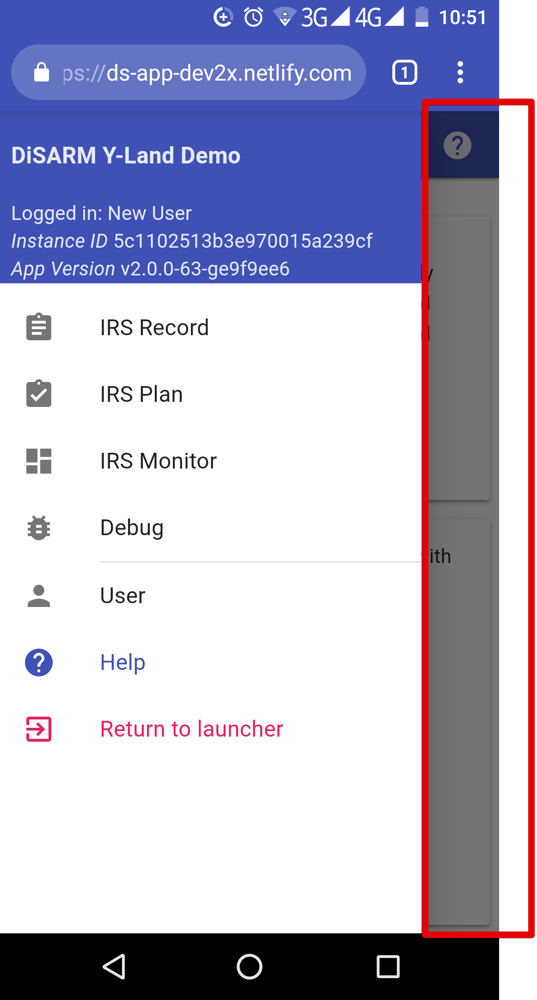

### **User Page**

The first page you will see after clicking the "login"After logging button is the User Page. It lists the sections of the application you are allowed to access pre-selected by your application administrator. These sections are sometimes referred to as modules and a user who has full access will have:

* IRS Monitor
* IRS Plan
* IRS Record
* Debug
* Geodata

> Note: Some application modules will have customized names and a higher or smaller number of modules based on the configurations of your application administrator.

Below the list of modules the text text shows your the version number of your application. When clicked it displays the version number of your configuration and some more device information that includes your browser name, version, operating system and your device name.

### **Sidebar**

After logging into the DiSARM application, you can view your modules in the sidebar. These modules are the same as those listed on the User Page and are pre-selected by your application administrator. To open the Sidebar, click the sandwich icon \(three small horizontal lines icon\) on the top left corner of the screen. 

The Side Bar will display the following information:

* Title given to you DiSARM application
* Version of the DiSARM application being used
* Instance ID \(also referred to as testing ID is set during log in so that testing data and settings are not saved with real data\) _not always there_
* Modules made available by your application administrator
* User Page navigation option
* Help option
* Return to launcher

Close the Sidebar by clicking anywhere outside of the Side

