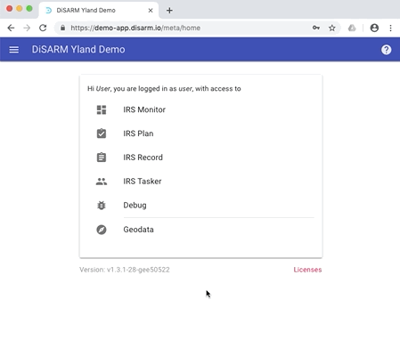

# Try out DiSARM app

##Introduction 
The DiSARM application has version that has been deployed for demonstration puporses. All the modules of the DiSARM application have been made available to anyone who would like to try out the application. 
> Note that this version cannot be used for actual spray tracking activities, it is only for demonstration purposes. 

##Access details to demonstration app
Link: https://demo-app.disarm.io

User: user

password: m

Once logged in the user page will be displayed and this is a menu from where you can start exploring the DiSARM application. For a guide consult the application manual found on the link: https://docs.disarm.io/app-v2 

##Creating fake data
The DiSARM application has an option to create fake data very quickly on the debug module. The steps are listed below:
1. Visit debug
2. click on "Crete fake data"
3. Enter desired number of areas to get randomly 0, 1, 2 or 3 records from each location also picked randomly from the provided geodata
4. Visit the IRS Record module
5. Click options
6. Select synch to upload
7. Then records can then be retrieved and viewed on the IRS Monitor monitor  

or follow the steps executed in the video below:

##Screencast
The video below is a screencast of the DiSARm application in use. It starts with the process of logging in, using the IRS Planner module to select areas to be sprayed, data collection on the IRS Record module and finaly viewing the data that has been collected on the IRS monitor module. 
Content coming soon....

