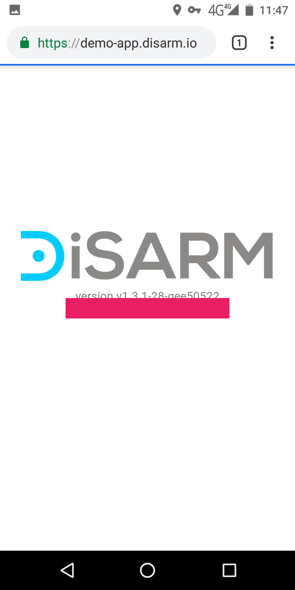
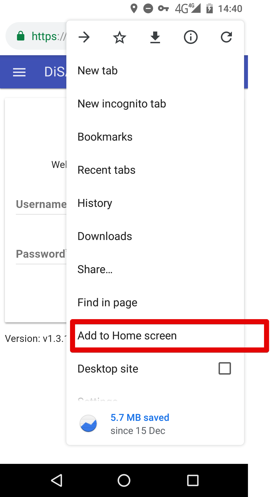
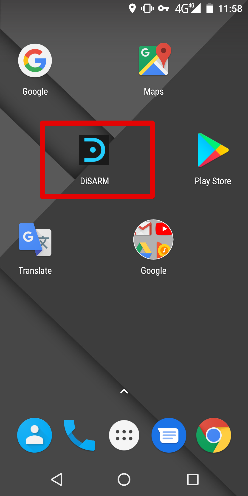

#### How to download DiSARM

### **System requirements**

The system requirements listed below are fully supported by the DiSARM application.

#### Mobile Phones

Operating System must be Android or IOS

Browser must be Google Chrome from version 40 upwards

#### Computers

Operating System must be Windows or Mac

Browser must be Google Chrome from version from version 40 upwards

> Note: Although other browsers my work, we recommend using google chrome as Chrome is fully supported. Other functions may not work well on other browsers.

#### **Memory usage**

A mobile phone must have at least 20 MB of storage free to open and download the application on the browser.

##How to download DiSARM to mobile phone/tablet

To access the DiSARM application your application administrator should give you a web address \(URL\) where your application can be accessed. DiSARM is most compatible with Google Chrome browser

## Automatic pop-up
The application will pop up a message; "offline ready" once it is finished loading. At the bottom there will also be a message: "ADD TO HOME SCREEN". To download the application to your mobile phone click the message.

A confirmation message will pop up and you should click "ADD" to download the application, or cancel if you want to keep using the Google Chrome whenever you are using DiSARM.

When the application has been added to your homescreen, you will receive a notification saying "DiSARM added on home screen". You may get a different name, depending on what name your application administrator gave the application when they deployed it for your organisation.

## Manual method
If you do not get the pop "ADD TO HOMESCREEN", you can add the application to your home screen manually by selecting the "Options" button on the top right of your browser.

Click "Add to Homescreen" to download the DiSARM application and follow the step number 3.

After clicking "Add," the system will start downloading the DiSARM application to your device. When the download is complete, you will receive a notification on your browser and on the notifications bar at the top of your device.

A DiSARM icon will show on your device among the other application icons as shown in the image below:

> Note: If you are on a desktop, the downloaded application is saved in your browser automatically. DiSARM can now run offline on your browser after it has been downloaded.