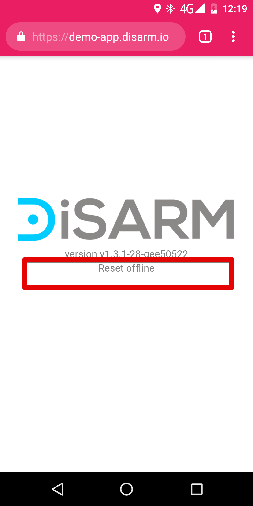
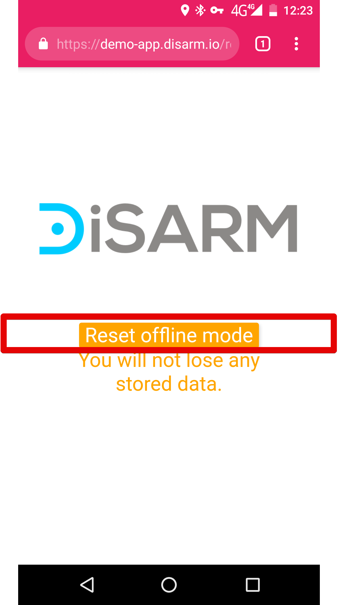
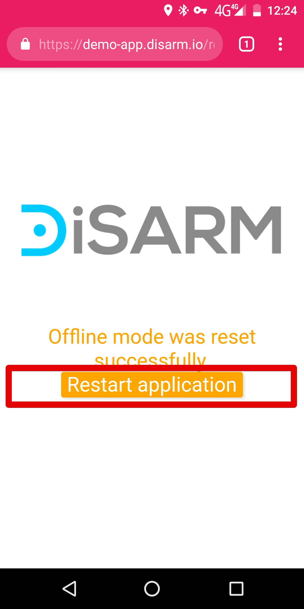
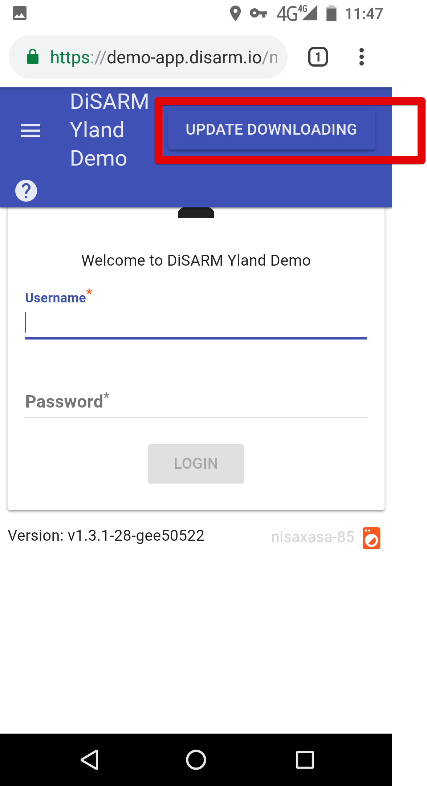

# Frequently Asked Questions

### **Reset offline**

In the unlikely event that the application stops working, please reload the application. If it is still not working there is a function to reset it by selecting the "Reset Offline" option under the DiSARM logo.

> Note: Although you will be resetting the application offline, the application will not delete any data that you have already collected and saved to your device.

You will be presented with a screen informing you "you will not lose any data, click the button labeled "reset offline mode"

The page shown above can also be reached by editing the URL in the address bar. You have to change it to URL-given-to-access-disarm/reset.html

In other words you add /reset.html. The first character there is a forward slash\(/\). In our public demo application it would be [\[https://demo-app.disarm.io/reset.html\]{.underline}](https://demo-app.disarm.io/reset.html)

You see a message saying stating "offline mode was reset successfully". Click "Restart Application" button to start using the application.

> Note: The "restart application" button will bring you back to the Login page.

Resetting the application will log you out. Make sure to do it if you are not using the application offline \(if you have network\) to log back in as it is not possible to log in if you do not have network.

### **Updating**

When the DISARM application is connected to the internet, it will automatically check to see if a new version is available. If a new version is available, it will download automatically and update in the background. You can continue to use the application during the download. Your data will not be affected by the update. When an update is being downloaded, a message stating "Update Downloading" will show at the top right corner of the toolbar.

You can dismiss the message by clicking it.

> Note: Updates may not be successful due to slow internet connection. If the update is unsuccessful or your browser freezes during the download, try a "forced reload" by pressing Ctrl+Shift+R on Windows \(Cmd+Shift+R on Mac\). on a mobile phone touch the screen at the top and drag to the bottom. The application will automatically attempt to download the update again. Your data will not be removed as a result of the forced reload. However, **any unsaved forms \(incomplete data collection in the record point module\) may be deleted.**

## How can I report if something is broken?

-   You can also send an email to [help@disarm.io](mailto:help@disarm.io).
-   Send a WhatsApp message to the number stated in the help file of your DiSARM instance (included in some instances)
-   Report to your superiors in your organisation
-   Create an issue on our github plartfrom found on this link: [https://github.com/disarm-platform/user-requests-and-feedback](https://github.com/disarm-platform/user-requests-and-feedback)

## I have forgotten my username or password.

Contact the application administrator or your superiors

## Can I edit records after I've synced?

It's only possible to edit records *before* you sync. At the moment, after they\'re synced you will need to ask your application administrator if they have the possibility to do so.

## Can I collect data without being logged in?

It is not possible yet to collect records without logging in. the application administrator needs to give a user read and write permissions to access certain parts of the application, in this case the IRS record module.

## My application has stopped working. What should I do?

Reloading the page often helps, it has the same effect as closing and reopening it.

Reloading the page is done by dragging from the top of the screen to the bottom with your finger. Should this not work press the options button of your browser and then click on the circular arrow shown below:

Exiting the browser and opening it again also helps. For more information check the "reset offline" section of this document.

## What do I do if my application is not opening/loading at all?

This is usually due to a network problem and can be solved in many ways:

1.  Switch from Wi-Fi to mobile data network

2.  If already on mobile data you can try turning on the data saver in the settings page. On Google Chrome you go to the three dot options button on the top right corner of the screen, go to settings, then go to data saver which is under the advanced tab on the settings page. After clicking on data saver there should be an on/off switch on the top left corner which will change state when touched between on and off. Turn it on and reload DiSARM

3.  If the user has access to a Virtual Private Network, connecting through it helps too. The VPN is useful for sending your network request like it is coming from a different location so that DiSARM loads in your country.

4.  Domain Name Server (DNS) address 1.1.1.1 also helps in making DiSARM load up well.

5.  Check the "reset offline" section on this document

## Where does my data get saved?

DiSARM application data is first stored on the data collectors device. No one else can see it unless they have physical access to the device. Once the user syncs their device, this data will be sent to the server where their DiSARM instance is set up to store data.

Users can choose to hst the application on their server should they be worried about where the physical server that hosts their data is.

## What happens to old versions of a plan?

When saving the plan the user must not click on the update button next to the plan if they still want to see that specific version of the plan. When creating a new plan the user must give a new name to this plan and not update the existing on inorder to keep it saved in the database.

## How can I view an existing plan?

The user can go to the "Planner Module", click the "Options" icon, and select "Load Plan". The application will display a list of names of the existing plans. Click on a plan to load it on the map for viewing.

## Who can see my data?

No one has access to the data aside from users who have permissions or rights to use the dashboard/monitor module. These permissions and rights are set up by the application administrator.

## What can I monitor using the DiSARM application?

The DiSARM application can monitor progress, coverage, and team performance of your campaign. The application can interpret your data by producing visuals such as maps, tables and charts to improve decision making.

## Offline functionality

The section of the application that is designed to work offline is the data collection section. So users can fill in the data collection form in remote areas without network. Other parts of the application may work offline, however these are not fully functional.

## Data usage

-   DiSARM is designed to use the smallest possible amount of data. When possible, base files are only downloaded once.
-   For the simplest use (access to the IRS Record module), we only need to download the application, which is less than 2 Mb.
-   Syncing records is around 10 Kb for sending 100 for responses, but with a minimum size of 1Kb per sync - i.e. syncing 1 record is still 1 Kb.
-   For the base data used in the Plan, and Monitor components, the application needs some \'geodata\'. Depending on the instance, this can be between 2.5 Mb and 7 Mb. But this should only need to be downloaded once.
-   Once you're up and running with either the simpler Record component (\~ 2Mb), or one of the more advanced mapping components (\~ 9Mb), you should be able to restart the application without needing to load any more data.

## GPS accuracy

The GPS accuracy is recorded and synced with the form record, it is shown next to the GPS coordinates on the page that requires that you get your GPS location (data collector).
