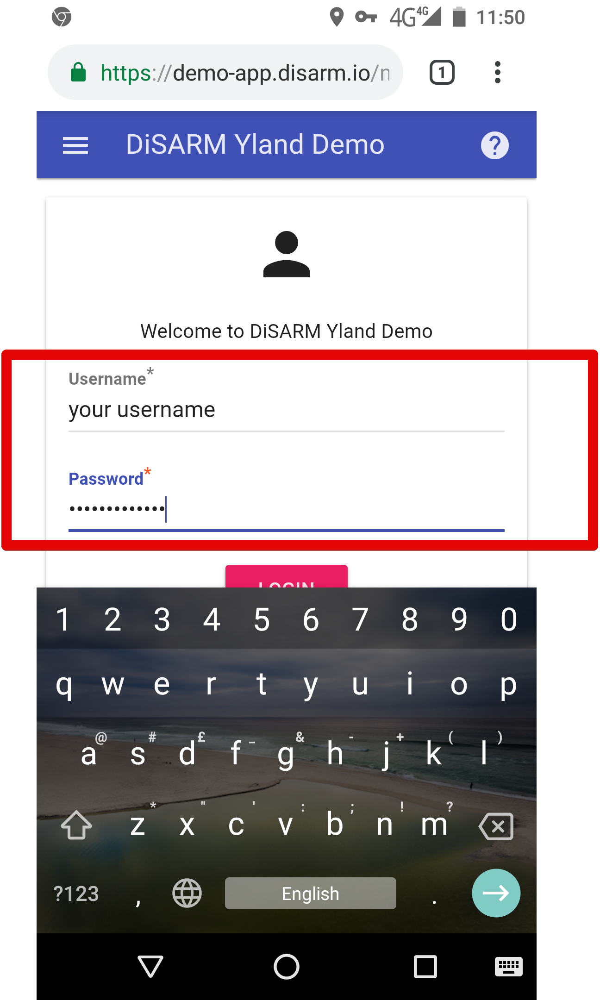
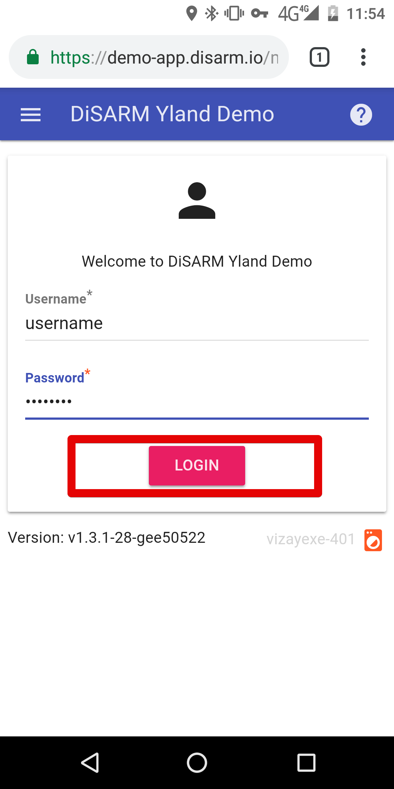
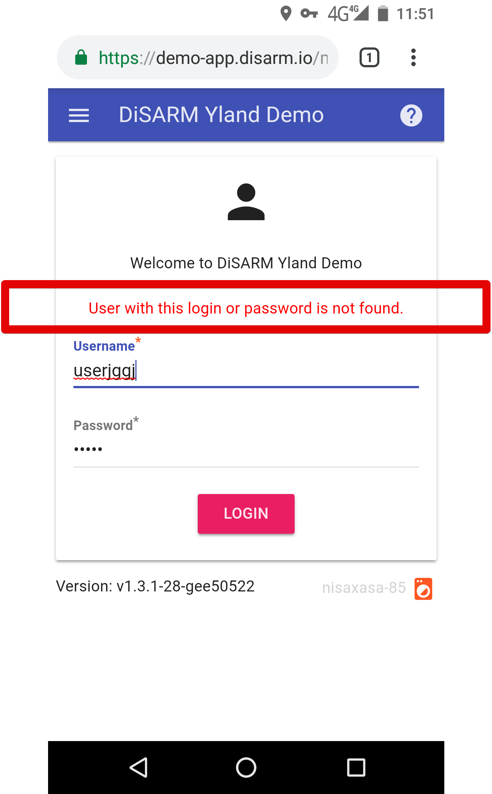
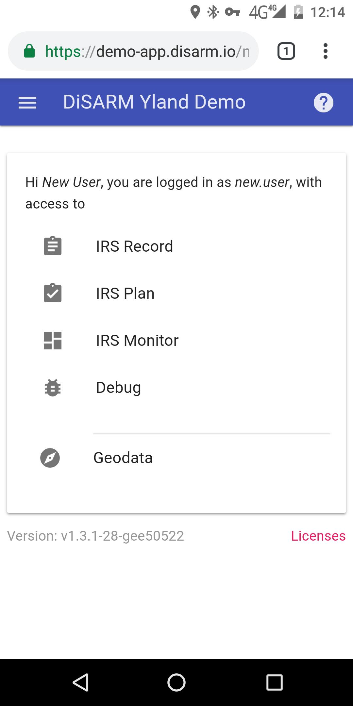

### **Log-in**

Open a Google Chrome browser.

> Note: The DiSARM application may not function properly using other browsers.

Enter the URL for your DiSARM application. This will be provided by the person who sets up the DiSARM application for your organisation.

Enter your username and password in the login page and click "Login." If you do not have a username and password, contact your superiors.

The login button becomes red \(activated\) which means it can be used to log in once login details have been entered in the text fields.

If the login details are wrong you will be shown a message in red saying "User with this login or password is not found".

Once you are logged in you will see a menu of the parts or modules of the application that you are allowed to access as shown below:

