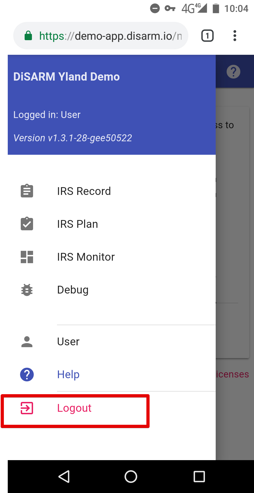

### **Logout**

Open the sidebar by using the sandwich button on the top right corner of the screen and click on the Logout link from the options presented.

> Note: If you log out while you are offline, you won\'t be able to use DiSARM again until you login \(which you can only do if you\'re online\).