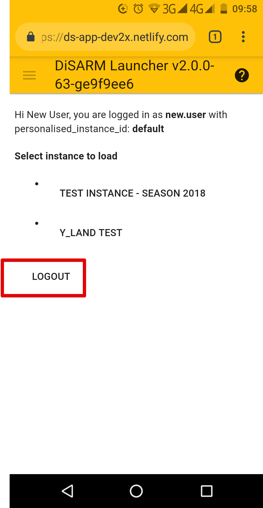

### **Logout**

Open the sidebar by using the sandwich button on the top right corner of the screen and click on the "Return to launcher" from the options presented.

> Note: If you log out while you are offline, you won\'t be able to use DiSARM again until you login \(which you can only do if you\'re online\).

on the launcher page the user can then click the "log out button" that is below the list of instances to log out.
