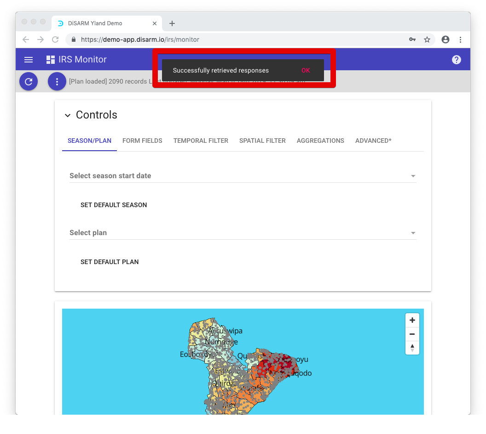
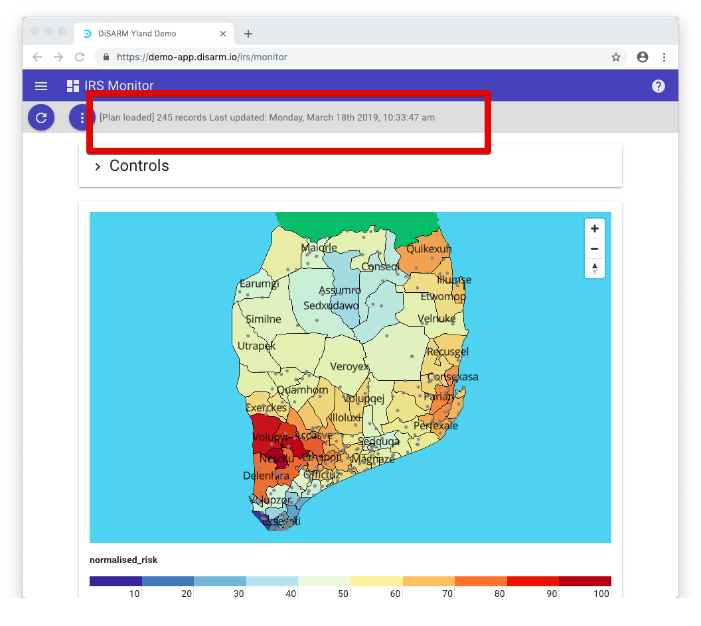

# Monitor

The Dashboard Monitor module is used for visualising your data after it is uploaded into the DiSARM application. It can produce visualizations in the form of charts, graphs, tables and geographic displays.

When you first visit it you will be presented with a window that has the map of the geodata that was uploaded by the application administrator. By default the map will be showing the risk layout of malaria over your geodata. The application will load the plans so that they can be selected to be viewed on the map. A pop up will be shown to show if plans were retrieved successfully, and it non exist yet the application will display a pop up message with no "plans loaded"

## Options button

The three dotted button when clicked shows four options. It is shown on the top left corner of the page

The first option "load plans" \(shown in the image below\) is useful when the user has created a new plan on the IRS plan module or section.the plan will need to be loaded on the monitor module. So the load plan option will download the plan from the planner section and get it ready to be used on the map should the user want to view everything \(record points, spray progress \) restricted to the plan.

## Retrieving responses

To download responses the user must select "Retrieve responses" and this means is that responses that have been uploaded/synced by different users who were collecting data using the data collector/record collector module. Note: This only bring the records to the monitor module, it does refer to downloading them to the local storage of the user's device.

When the user clicks download the application will pop up a message "retrieving more records" as shown in the image below:

Once completed the message will change to "successfully retrieved responses":

The third option, "Re-retrieve all" responses downloads responses again. It is useful in the case where more records have been uploaded/synced by other users after you had already used the retrieve responses option. Once clicked it follows the same steps illustrated above to retrieve the responses.

The last option, "Download responses" will be activated only when record points are showing on the map. When clicked it instantly downloads a Comma Separated Values \(CSV\) of the records.

Note: this is restricted to the records showing on the map before or after applying filters only. So if the records have been filtered by plan or dates, therecords filtered out will not be downloaded, only the ones showing on the map will be put in the CSV file and downloaded.

Next to the buttons in the bar the text illustrates whether you have loaded a plan, number of records showing on the map \(retrieved\) and the time and date when you last downloaded records and loaded the plan. In the example below 245 records have been retrieved.

This is how the text looks in a close view:

## Controls

The "Controls" drop down menu contains different kinds of tools that can be used to set aggregations and filter the records. When you click on the Controls it opens a panel with six tabs titled:

* SEASON/PLAN
* FORM FIELDS
* TEMPORAL
* SPATIAL
* AGGREGATIONS
* ADVANCED.

The image below shows how the controls section looks like when you open it by clicking anywhere on the "Controls" bar \(shown in the previous image\).

## Seasons

The first item on this tab is a selector marked "select season start date". When clicked it pops up a list of season start dates and when the user selects one of these it sets a filter that will make the dashboard display records that were recorded on that date and later on till the date before another season starts. Season start dates are added by the administrator in the configuration file.

 &gt;

Clicking on the dropdown in the red rectangle above will get the seasons start dates and you can choose one as shown in the image below: 

## PLAN

The plan is a list of areas selected in planner module and set aside as areas where spraying will be done. If there is a plan that has been created in the planner module the user will click on the load plan selector and will be presented with the list of plans. Selecting one will make the dashboard display and aggregate records that are inside the areas selected when creating the plan. Plans are automatically retrieved from the planner module when opening the dashboard, the user only needs to click on the one they would like to load on the map. If there is no plan created the selector will display the text; "No plans loaded - create a Plan and then click 'Load plans' in the menu above'" and it will be in inactive \(not functional\).

 &gt;

When plans have been created the selector will have the text "select plan" and once clicked on it will display the plan names so the user can choose one as shown below;

## FORM FIELDS

The second tab in the Controls is used for filtering according to a type of identifiable piece of information collected. For example, the form field allows you to sort your data by field name, username, recorded\_at and etc. theses form fields come from your records. The application checks all the properties or fields you records include and then lists them in this part to use for filtering. Select how you would like to sort your date by clicking on the drop down menu, select either "equals" or "not equals to", then put the value you want to compare with and lastly click the add filter button.

 &gt;

In the example below once the "ADD FILTER" button is clicked only records with the value 3 for the number of bendnets field will be shown.

The results are shown in the image below. There are three areas marked in red where the application shows that there are filters that have been applied. This means that the data that is shown is missing as only records where there were three bed nets are showing. If the user decides to download all records with the filters applied they will get the number of records that were left after applying filters \( in this case only records with where the number of bednets was 3\)

## TEMPORAL FILTER

The temporal filter has two text fields which you can tailor to display records that lie in a specific range of dates.

 &gt;

To navigate around the calender the user can use the arrows to go forward or backwards in the level of what is presented at the top center of the calendar, by default it is by month. If you click on it it goes to years and displays months below, when clicked again it will go to year displaying a decade in each page. Once you select a year it will show you the months and when you chose one it will show you the days and you can choose one.

The text fields are labeled "from" and "to". Once there are dates in both from and two the "add filter" button will be activated and when clicked it will make dashboard show records that are in between those dates. The date in the "from" field should be earlier than the "to" filed, so if one of the calendars becomes inactive the user must ensure the dates are arranged well.

This time as shown in the picture above the application will say that there are two filters active because there are the two dates, one filter is restricting to show records later than the selected date and the other filter is restring to show records recorded before the selected date. The user can select one date if they want and then click on "add filter" and there will be only one filter showing records before or after the selected date depending on which date field was used. The reset button removes the dates that were previously selected to filter by.

## SPATIAL FILTER

The spatial filter is used for showing records that are in a certain geographical area. The application can filter to whichever level your geographic data was collected \(e.g. country, region, district, village/community\).

 &gt;

The spatial filter, as shown above, is found on the fourth tab of the controls section. The user needs to click on the drop downs there\(labelled "select area" and "select sub-area"\) and click on each one to show the list of areas there are.

Once clicked the drop down will show a list of areas for the user to choose the one which they want to filter with. There may be more than one drop down in other cases, it depends on how many levels the geodata has and in our example there are only two with the higher level being a region. The image below shows what is displayed after clicking the top drop down to see the regions.

The image shown below is what is displayed after choosing an area. The options inside the red rectangle \("Select sub-are" and "ADD FILTER"\) are not active/functional unless the user has selected an area on the top drop down for the higher level areas of the geodata. The "Select subarea" is not active because it shows sub-areas that are inside the area or region which should be selected above. The "ADD FILTER"is only active after selecting an area on top drop down to give the user an option to filter with only that area/region \(by doing so showing all the records in the sub-areas that are in that area\).

Once the user clicks the button labelled "add filter" the appplication will show only records from the area the user has chosen. In the exampe below the user has chosen Nautusben region and Maiorle area and that shows 94 records in that area

The user has an option of adding another to view records from the previouse area \(Maiorle inside Natusben region\) and the new area desired by the user. this can be done by repeating the previouse steps of adding a spacial filter i.e. select region, select subarea and click add filter. In the example shown below a area from a different region \(Nondefo region\) has been added and the area name is Porroyug. The number of records displaying now increased to 145 as shown in the image below and the user can add more spatial filters following the same steps shown on this section:

## AGGREGATIONS

The fifth tab on the controls is used to change the way the records are displayed by grouping them inside time ranges and location. When you open the tab you will be presented with two sections:spatial aggregation and temporal aggregation.

Under spatial aggregation depending on your instance setup you will be able to aggregate according to the list of levels your geodata has. In other instances there might be more options. The change will be effected on the table that is below the map on the dashboard. The records are displayed in a grouped format \(aggregated\) according to the button that has been selected among the ones in the spatial aggregation. In our example the option we have are the small areas which in our instance are called sub-areas. The name "locality" comes from the geodata name given by the administrator when setting up the DiSARM application.

The table that is being referred to above is shown below and as mentioned it is found below the map on IRS monitor module:

> Note: it is only shown if there are records shown in the map so it will not be there if there are no records retrieved, or if all the records have been filtered and non fitted the required criteria.

The second section, temporal aggregation, affects the way the graphs are displayed below the table in the dashboard. The bar graph that displays coverage has the bars labelled according to the aggregation selected. They could labeled with week dates, months, quarters of the year or years.

Graph visualizations aggregated by week are implemented by selecting "week" on temporal aggregation as shown below:

And graphs will be displayed in the format shown below:

Graph visualizations aggregated by months of the year are implemented by selecting monthly on temporal aggregation as shown below:

Graph visualizations aggregated by month:

If the user desires the graphs can be aggregated to display progress further aggregated quarterly or yearly.

## ADVANCED

The advanced tab will have options that are not used in normal circumstances but make a huge difference in you monitor tab once used. Users should be cautious in this section since any changes made here will impact the results displayed on the monitor page by showing a different number of points than the ones included in coverage calculations.

On this tab the user is presented with a warning message as shown below on the image and below the warning there is a checkbox labeled "**Include Responses and geodata outside Plan**". This is where the user will choose to ignore the plan created in the planner module and show all the records that were collected including those that are in areas that were not included in the plan. 

Once checked a warning message will be shown that: "The checkbox above means you are showing responses outside the plan. This will display responses on the map and include them in aggregation calculations, but note that they will not be included in any coverage calculations. Uncheck to limit responses to the plan."

So if the user clicks on it, it gets checked and then the dashboard shows all the responses on the map but does not include them in coverage calculations.

In the example shown below the user has ten records inside the plan, after clicking/checking the checkbox to show records that are outside of the plan the number of records increased by six to be show sixteen records.

Before showing records outside of the plan:

After including records that are outside of the plan

The option to select "guess locations" is used to add GPS coordinates for records that are missing the GPS coordinates. Sometimes the application administrator will set the collection of GPS coordinates optional so that if the device does not manage to collect GPS coordinates when offline the user still manages to record that they sprayed somewhere.height="2.0416666666666665in"}

## Map

The map is shown in monitor module below the "Controls" section that has been discussed above. It is used to see in which areas there record point have been collected \(using the IRS record module\).

The user can zoom in or out of the map around the map by clicking on the plus or minus buttons in the top right corner.

To view other sections of the map, click and drag on the map to reveal the hidden, or use the arrow buttons on your keyboard. To change points of view on the map \(e.g make it look flat\) you can click and hold on to the button on the top right corner that is labeled with up and down arrows, then move the mouse till you find the position you desire. As an alternative hold shift on your keyboard and press the up and down arrow buttons until you have adjusted to the view you would like.

If there are records that have loaded on the map, they will appear as dots located on the map.

If your application administrator has defined decorations, the response points will be in different colors. Red dots mean the structure has not been sprayed and green dots mean the structure has been sprayed. Note: The colors may be defined to mean different things by the application administrator.

When clicking on a dot, a summary of the record will be shown. The information shown in the summary is determined by the application administrator. height="3.299504593175853in"}

When a plan is loaded, the map will paint the areas that were selected when making the plan in a different color that stands out. The color depends on the layer that has been selected below the map. There is a selector labeled "show areas by". Between the selector and the map there is a legend bar labeled zero to 100 with its color changing after 10 units.

## Layers

In the example below the layer selected is "risk", the legend at the bottom shows that the red areas have a higher risk of malaria, while the on the low risk the color is almost blue.

The layers below include risk, coverage and sprayed structures. If the user selects a layer \(e.g. coverage\), the application will color the areas on the map according to the colors of the bar between the map and the selector as indicated by the records to be in sync with how much has been covered in different areas. If a lot of areas were sprayed in a rea the color of an area will be blue and if nothing was sprayed the area will be red.

Risk layer with a plan with a plan that covers the southern part of the map

Structures Sprayed % layer. Note that there no records loaded, so the application has all the structures not sprayed and that is why it is all painted red.

The image below shows a checkbox labeled show response points, if the user unchecks it \(by default it is checked\) it will make the response points not show on the map. This will not affect the aggregations or the charts.

Note: this checkbox will not be active/functional unless there are records shown on the map.

## Summary table

The summary table is located in the dashboard/monitor monitor and contains the data from the response points that are being shown on the map. If the user has retrieved records and there are records displayed on the map, this table will be populated with those results otherwise the table will not be displayed if there are no records showing.

The columns shown in the summary table depend on the settings applied by the application administrator in the configuration file. The table has been designed to allow users to search their records using the text field at the top left corner labeled "Filter Results".

On the top right corner there is a number field which labeled "Records." By default, the application will show 10 records per page. This number can be adjusted to show more or less records per page.

Below the summary table, users are able to jump to specific pages by using the navigation bar shown below in the red rectangle.

Below the navigation bar, users can choose to "Download" the summary table into a Comma Separated Values \(CSV\) file which can be opened using software programs such as Microsoft Excel.

Note: The button found underneath the table downloads the table as it is. In this example the table has been configured to show the columns name \(of an area\), structures sprayed and structures sprayed %. So it will download summaries not the actual records.

## Graphs and Charts

The last section of the monitor is the graphical view of your spraying activity. This involves line graphs, bar graphs, pie charts and more. It all depends on how your DiSARM instance is set up. These graphs are set based on the information that you have collected using the record module.

Graphs without any records uploaded will appear blank and will only show the types of information being collected:

The disarm application is capable of displaying the graphs that are shown below for more examples:

