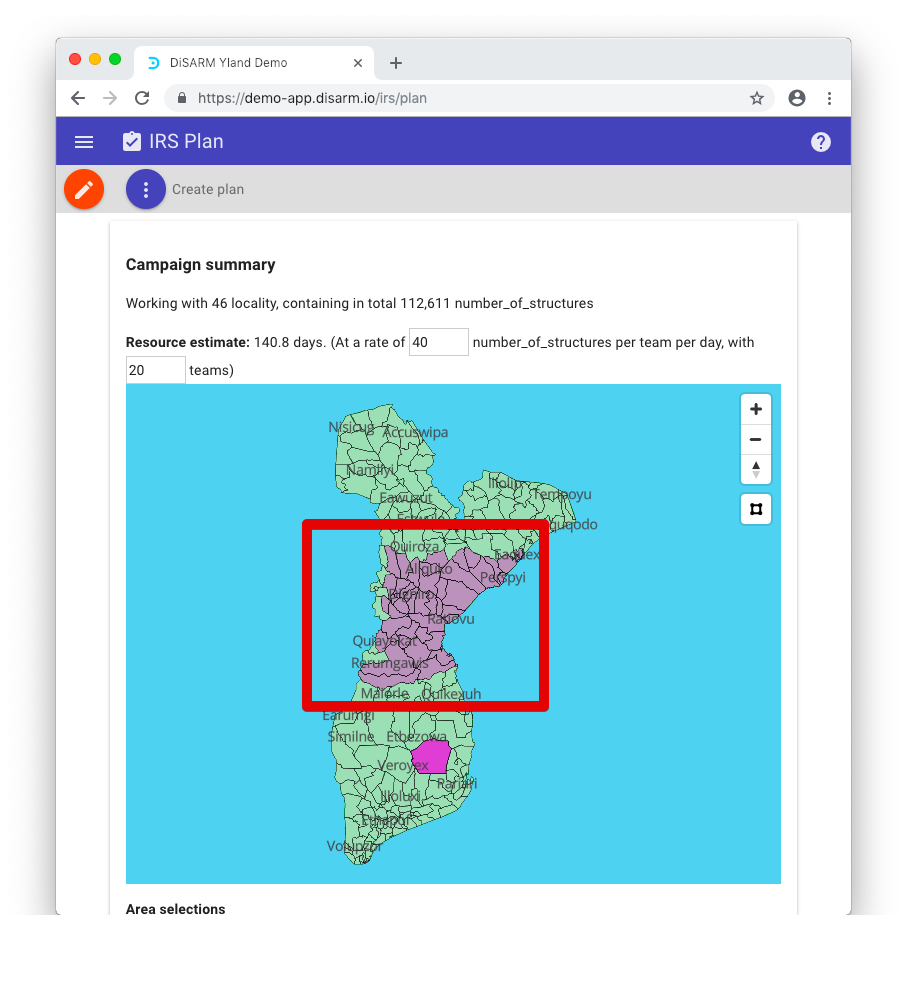
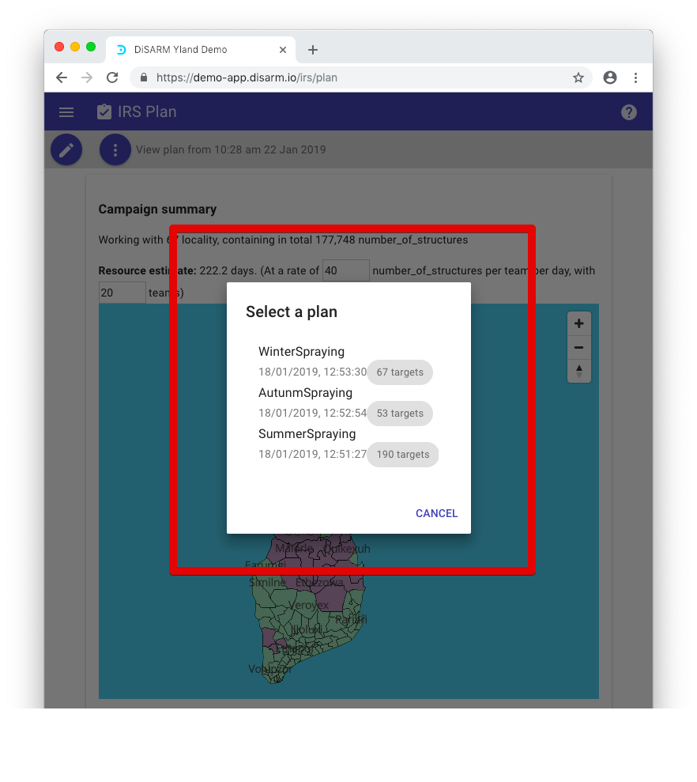

# Plan

The planner is a section that is used for selecting the areas where the spraying activity will be carried out. This module is very useful on the IRS monitor module where you can view the progress of your spraying. It is not mandatory to use this section of the application as the application is built to use all the geodata as the plan if there are no plans created.

When you visit it you will see a display like the one shown below, only it will have your geodata not the one shown below so the map will be different.

## Options

The planner has two buttons on the top left corner, one has a pencil icon while the other has three vertical dots. The pencil icon allows users to edit or create a plan. The user will need to click once on it so that they can select or deselect areas on the map

Once clicked on it will change color to orange and the user will be able to click on areas on the map to add them to the plan.

## Creating plan by clicking areas

When areas are selected/clicked they also change color to indicate to the user they are in the plan being created. The user can select as many areas as they want

## Creating plan by drawing a polygon

The user can also create a plan by drawing a polygon around the area they want to be to in the plan. This can be don by clicking on the small square icon on the right of the map area. If you hover over the icone a tooltip is displayed showing its name \(Polygon too\(p\)\)

Once you have clicked it the mouse pointer changes to a small + sign, signifying that you can start drawing your polygon. As you click to make corners of your polygon you will notice that it is always a closed shape. To finish just go to click on the first point you made when drawing the polygon and you will see by having a dot while like the previous corner you made, while all other corners will not not have dots

Once you close your polygon the application will instantly add to your plan all the unit areas that are fully inside the polygon with no parts of them outside. As mentioned above they will be painted in a different color to show that they are in the plan too. 

If the user wants to zoom in or zoom out on the map they can use the + and - icons show on the right of the map. The third icon with up and down icon in the same area of the zoom in and out icons is used for changing the elevation view of the map.

## Creating plan using the risk slider

Another way to create a plan is by using the risk slider that is shown below the map. When providing your geodata you can specify the risk of catching malaria of each admin unit/area which will be then used by the DiSARM application to help you select only areas that have a risk with minimum being the point of your choosing on the scale to put in your plan.

NOTE: the risk slider will not be displayed unless the pencil icon at the top right has been click putting the plan editing mode on.

To save you plan you must go on the three vertical dots button at the top right ot see the options

The options shown when the button is clicked are

a\) Load plan → paints the map with the plan that you will choose to load b\) Save plan → saves the plan that you are currently creating/editing c\) Clear plan → unselects all the areas that you had selected on the map so you have zero select areas on the plan.

## Saving a plan

Once you have finished selecting the areas that you want to include in your plan you can choose the save plan option. If it is your first time saving a plan, a pop up message will be shown with a text field to put in the name of your plan.

It will pop up a list of the plans you have if you have plans saved already for you click on the "update" button to replace them with whatever edits you made. height="6.286458880139983in"} If the user wants to view existing plans, the way to go is to start on the three dotted button on the top left part of the screen.

The next step will be a list of the plans that have been created in the application before. The user has to select the one that they want to view by clicking on the name of the pla. Looking closely to the names of the plans, the user will notice that dates of when the plans were last edited are shown underneath each plan name to make differentiation between the plans easier.

## Viewing a plan

Once a plan has been selected to be viewed, the top shows a campaign summary. The DiSARM platform has algorithms that calculate how long a team will take to complete spraying the selected areas that make up the plan. This is facilitated by other algorithms that get information from the Malaria Atlas Program of how many structures there are in the area and the estimated number of rooms.

The user has the option to download a geojson file for the plan. The geojson is a format designed for representing simple geographical features, along with their non-spatial attributes. The "DOWNLOAD PLAN GEOJSON" button instantly downloads the a geojson file of the plan that was being viewed \(selected after load plan on step 15\)

While viewing the plan you will also be shown a table which displays the areas names, number of structures in them and the risk in each of the areas that are included in the plan.

The "DOWNLOAD PLAN TABLE" button is used to download the plan information. It results in an instant download of a \(comma-separated values\) CSV file.

The download notification will be shown and the file will be found in your downloads folder:

The plan section of the application can also be used to show which parts of your geodata have high risks of malaria. This is activated by clicking on the "show risk" checkbox below the map. As the legend shows below the map, the areas with red and dark red colors are the ones with the highest risk of malaria.

