# Record

To begin entering data into the DiSARM application:

Select the "Data Collection/IRS Record" module from the User Page or Sidebar. When you visit the data collection module for the first time you will be presented with a page that looks like:

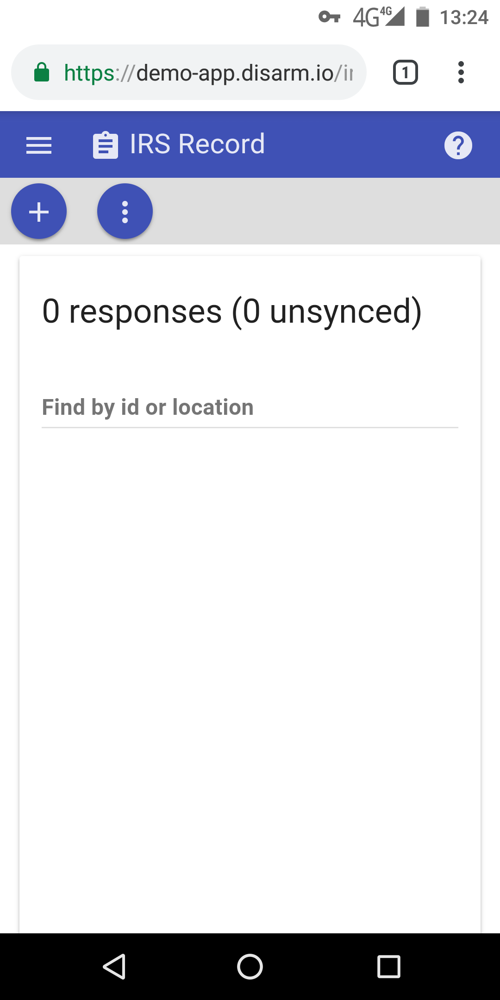

To add a new record, click the + sign in the top left corner.

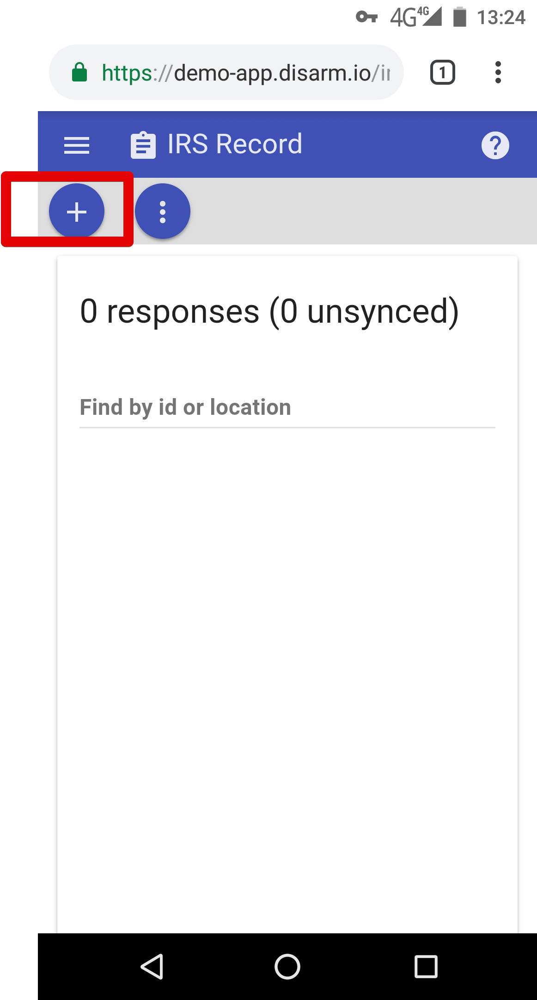

## Collecting a record

The meta data page might be configured to be displayed or not displayed by your application administrator, but if it is shown it has fields that are optional. Some of them can be changed and some cannot be changed, this depends on the settings applied by your application administrator. The one shown below displays the username of the logged in user, their user ID, a time stamp or record collection and the team name the user belongs to.

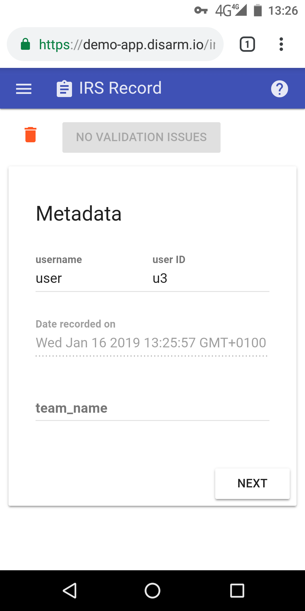

Enter your data into the form as prompted. This form has been configured by your application administrator. Generally the first part of collecting a record is the location selection. The standard location selection page is shown below:

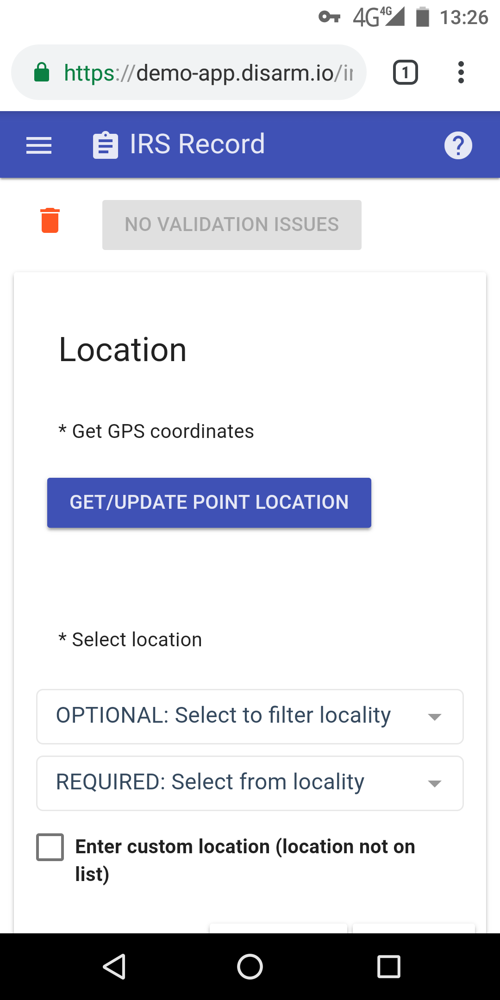

To collect the GPS coordinates of your location you click on the "GET/UPDATE POINT LOCATION"

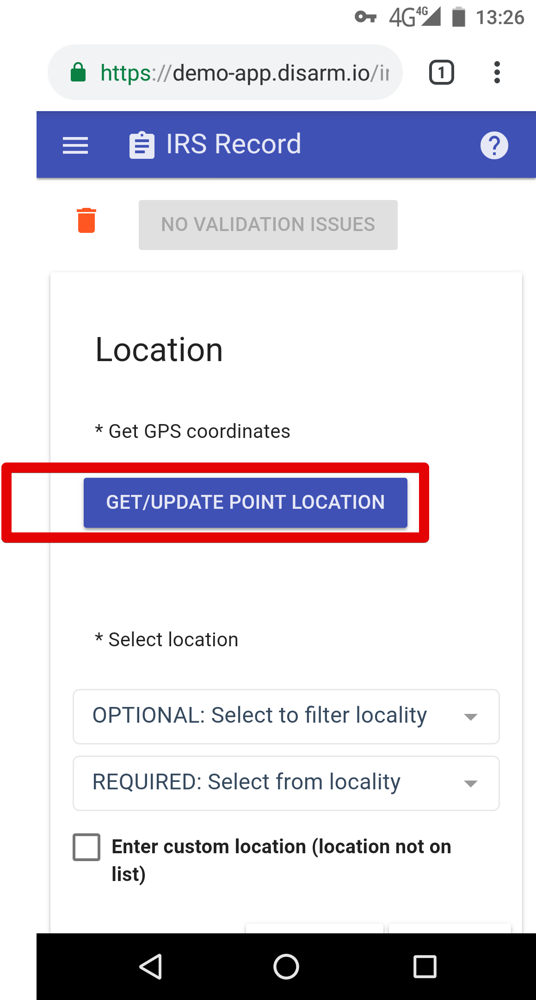

To set the name of the admin location as provided in the geodata you click on the "locality dropdown". As shown in the image below, the higher level \(first location selection\) is optional in this case because the lower level locality is the part of the higher level level one \(it is an area inside the region\).

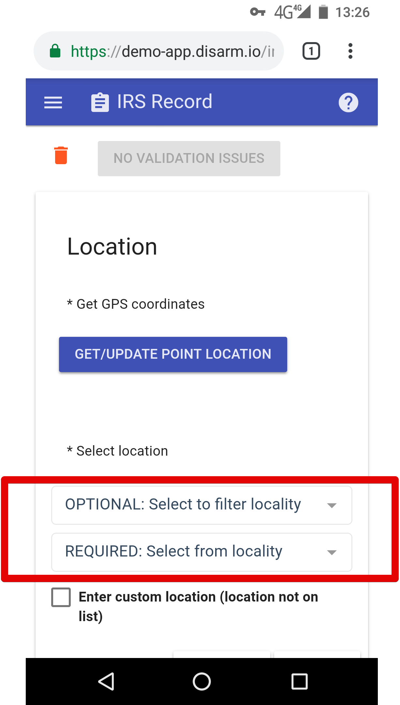

## Adding a custom location

If the location you are looking for is not shown in the locality dropdown you can add a custom by clicking on the "Enter custom location" checkbox

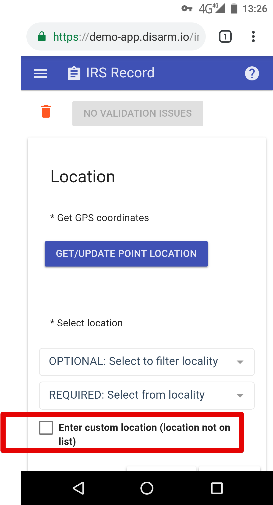

A pop up message will ask you to confirm that you want to add a custom location and if you are sure you nac click on "USE CUSTOM LOCATION". The downside with adding a custom location is that it will not be shown on the dashboard.

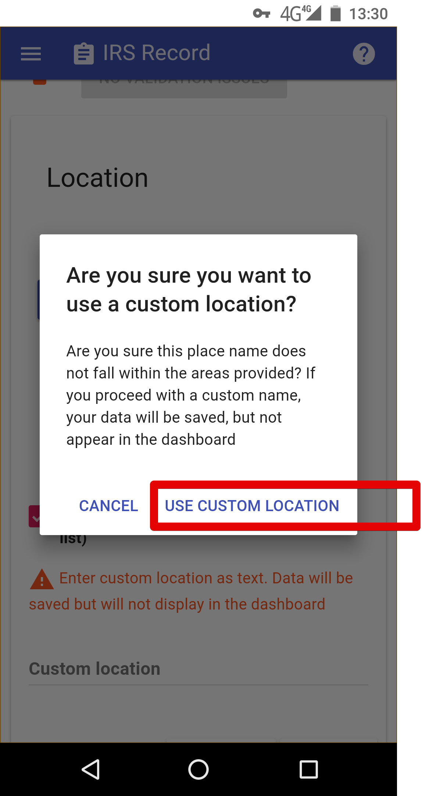

To continue adding the custom location select the text field labeled "custom location' and type the name of the location that you want to add if you did not find it on the location dropdown shown on step 6 of this section.

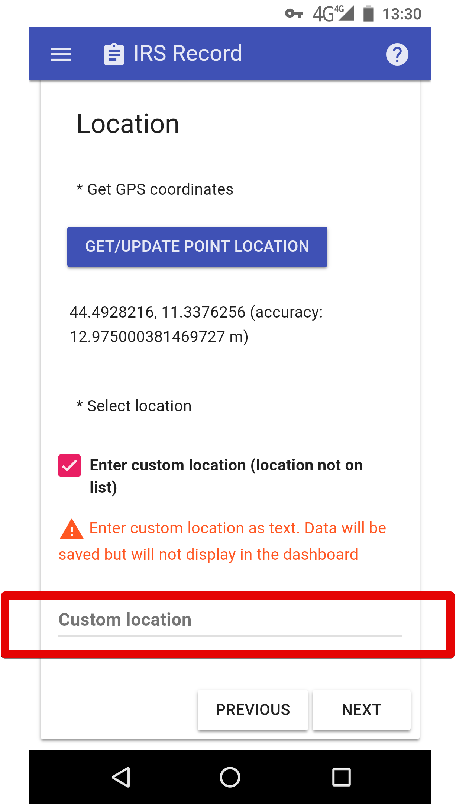

While adding the records \(filling in the form\) if you miss a required field or put in a invalid value errors will be shown at the top of the screen.

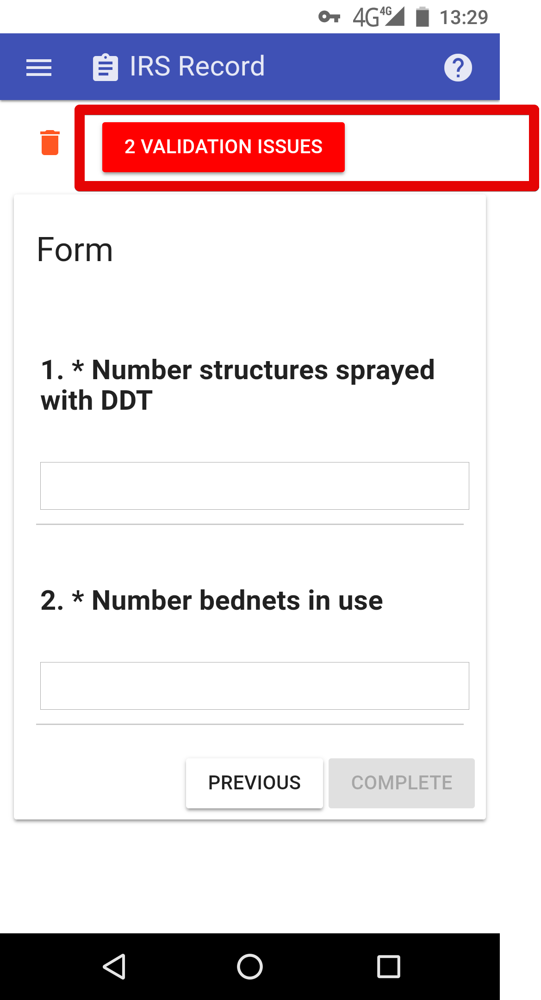

When you click on the button you will be shown where the errors are. In the example shown below the user forgot to get the GPS coordinates of the location. Clicking on the red text in the same line as the error message will make the erratic part be displayed below the error messages for the user to fix them instantly.

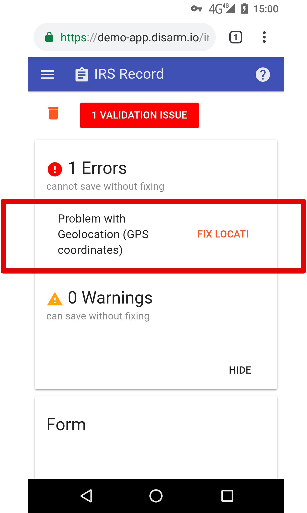

To continue filling in the form use the buttons at the bottom to navigate through the pages of the form until you rich the last page which will have the navigation buttons labeled previous and complete. Once the form is filled in with required data standards the "complete" button will be activated. All it does is save the complete form to your device only.

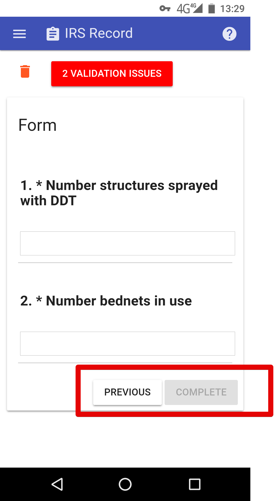

When you click it you will be brought back to the main page of the Data Collection/IRS Record that is shown on the first step of this section. The difference is that it will display the list of records that you have collected. If you have not synced them yet it will look like the image shown below. The user has collected 148 records and has not synced any of them. Syncing in our context means sending the records to the main database so that they can be downloaded by users who have access to the dashboard to view spray campaign progress, for this reason you have to be connected to the internet to be able to sync.

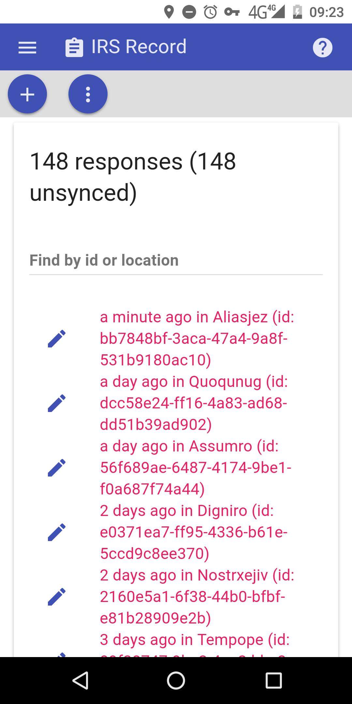

## Editing unsynced records

If you click on a record on the screen shown above you will be able to edit it. You can change any of the fields that you were able to input data into while collecting the record for the first time. So when you select one record you will be taken to the screen shown in step 3 only with the data already filled in in all pages but editable.

Otherwise the next step is to either sync the records or export the so you can have them on your device as a json file. These two options can be displayed by clicking on the three vertical dots button

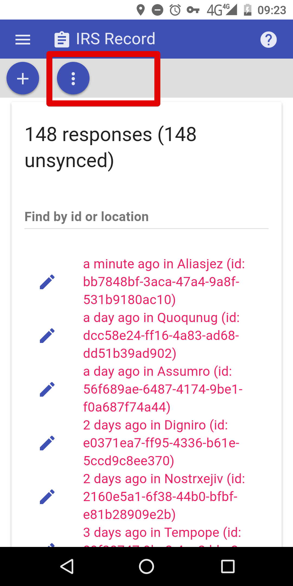

## Syncing and exporting records

The option to sync or export the data is not available unless you have records that need to be synced or exported. You can filter through the records using one of the values from form fields from the data collector form. This field is selected configured by your application administrator.

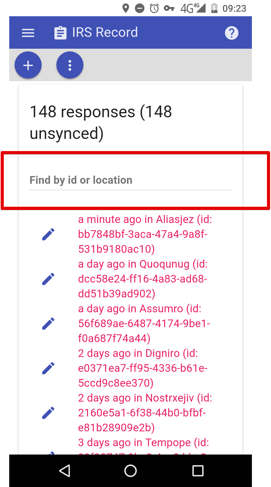

If the user wishes to have this records saved on an external json file on the mobile device; "export unsynced " should be clicked. The app will instantly compile the json file and start the download. A notification will be shown in the notifications area at the top and a pop up at the bottom.

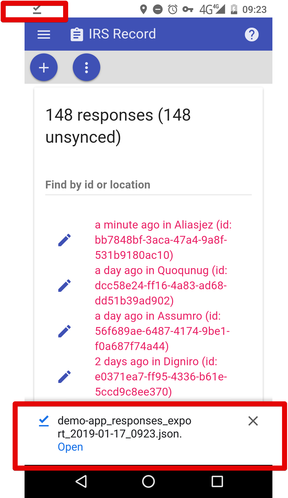

To sync the records the user should select the first option that is shown on step 15 of this section. The image below was taken after the records had been synced. You can see the ticks on the left of each record and the notification at the top stating the number of records that were synced

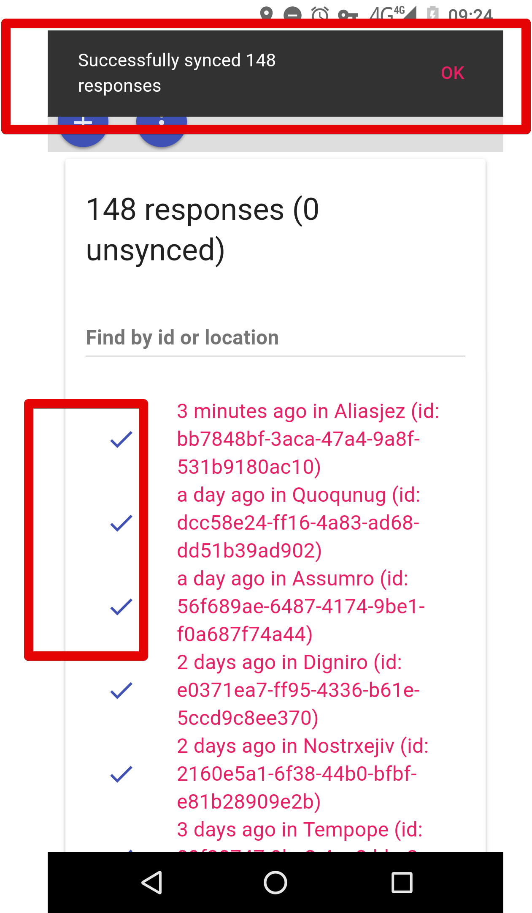

> Note: After syncing you will not be able to not be edit the records and you will not be able to export a json file of the records. If you want to get records you will be able to download them from the dashboard/monitor if you have permissions to access it. It is still possible to view records by clicking on them.

