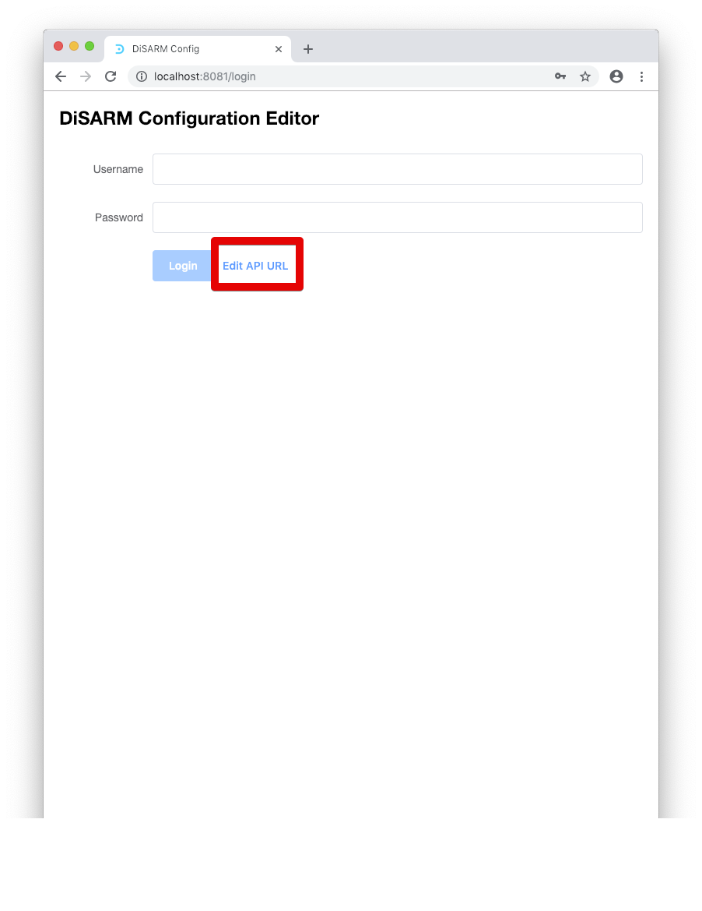
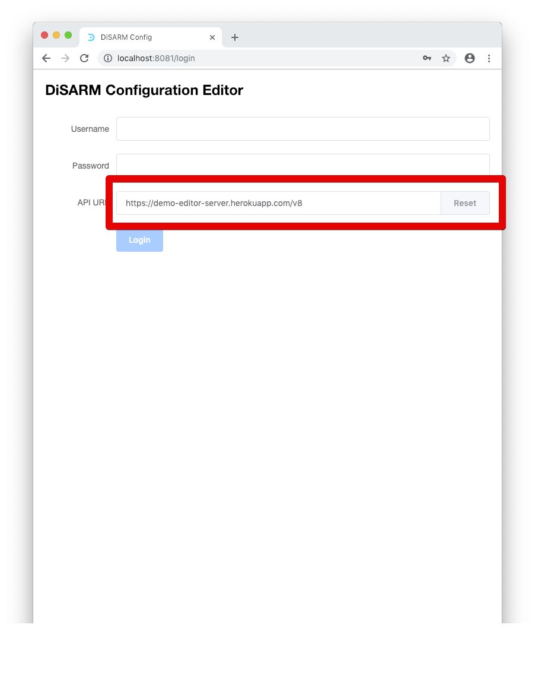

# Editor manual \(v1\)

## Introduction

This document is written for the user of the DiSARM application who has the authority to make changes to the application that has been deployed. It details how to create a DiSARM version, then create users, give them permission, set up the sections/modules of the application desired and manage geodata.

## Requirements

This is a list of the technical resources and knowledge you will need to have to be able to set up and manage the DiSARM application.

## Required resources

1. Link to the application editor
2. Link to the application front end
3. Geodata file\(s\)

## Required skills

* Some knowledge of JavaScript programming language. 

The steps below will illustrate how start from the resources listed above to a point where the DiSARM application is ready to be used by multiple users.

The architectural structure of the DiSARM platform is closely related to the three domains. It is made up of the application itself, the editor and the Application Programming Interface \(API\). the application consists of the GUI the users interact with, the editor is the User Interface the administrator user uses for making changes to the application and the API are the function and procedures making the computations and connecting the application with the database where the data is stored.

## Log Into your DiSARM app editor

To login to the disarm editor the user must go to the link that you set is provided by the person who deployed disarm for your DiSARM editor. The login page looks like the one shown in the image below. The user must make sure that the API URL is correct by clicking on "Edit API URL"\(is also supplied by the person who deployed DiSARM\).

After clicking the edit API URL button a textfield will be shown where there will be the current API URL shown. The user can change that if it is not the one they set in the second step of this document

Once you click the login button has been clicked the screen that comes next is one where the user can select or create a DiSARM instance. The word instance in this case refers to the deployed DiSARM application for an organisation. The concept of Instances can be used to separate data in case of different spray periods/seasons where the data should not be mixed.

