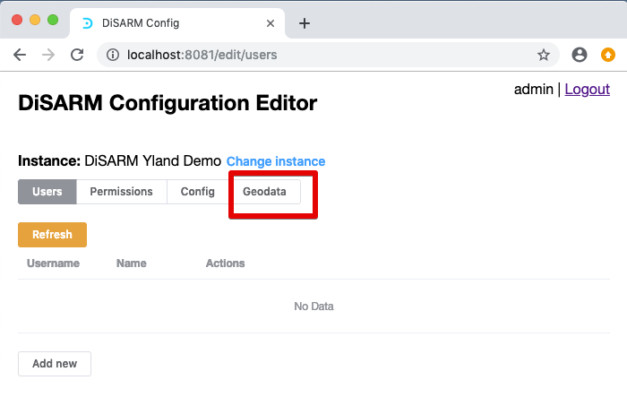
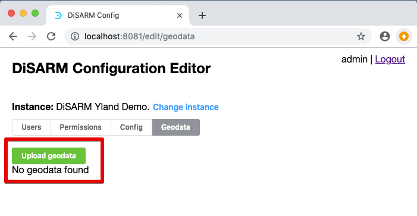
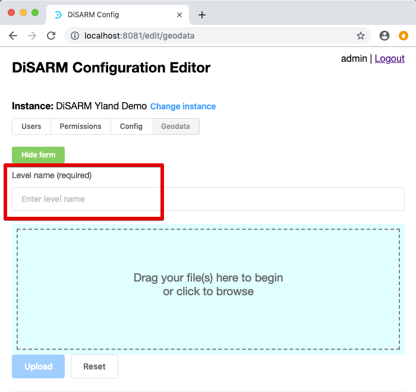
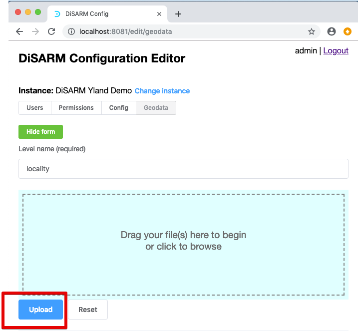
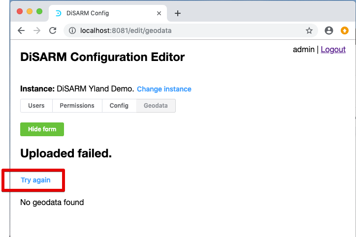
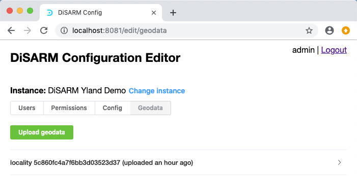
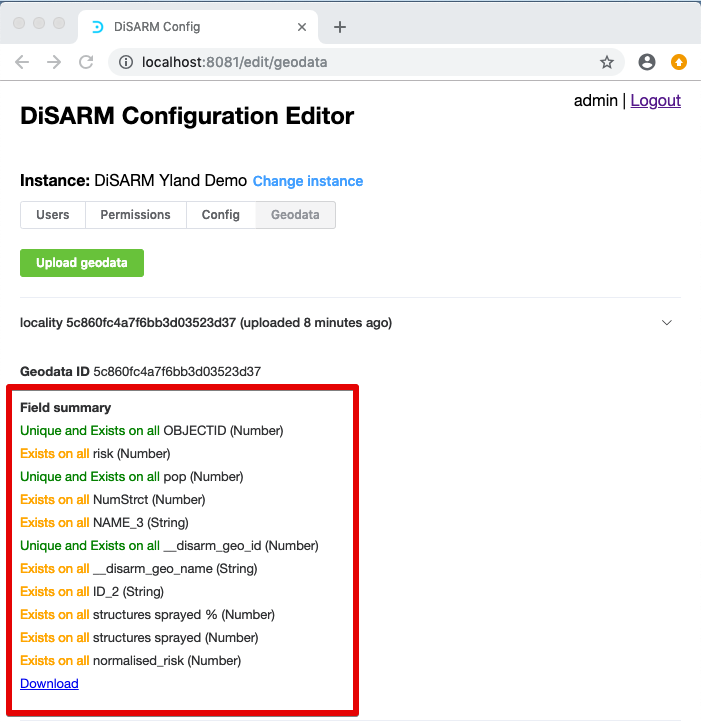

# Geodata

## Upload geodata

To upload the geodata, select the geodata tab on your configuration editor menu shown in the red rectangle:

After clicking on "geodata" the screen shown in the image below will be displayed. It shows that there is no geodata uploaded yet. To start uploading click on the "upload geodata" button that is shown with a read rectangle

A form for uploading the geodata. There is a first a space for naming the geodata \(shown with a red rectangle below\):

In this example the geodata is named "locality", then we upload the geodata by dragging the geodataIf the file is the right format to be uploaded \(GEOJSON\) the "Upload" button will be activated as shown in the image below.

If an error occurs during the upload, a message will be displayed saying "upload failed" and clicking try again will bring the user back to the beginning

## View summary

Once uploaded the list of geodata will be shown and you will be able to click on it to see a small summary of it.

## List of uploaded geodata

The list of uploaded geodata will show the name and automatically generated geodata ID. The image below shows the summary of the geodata which is shown when the user clicks on the geodata name on the list

