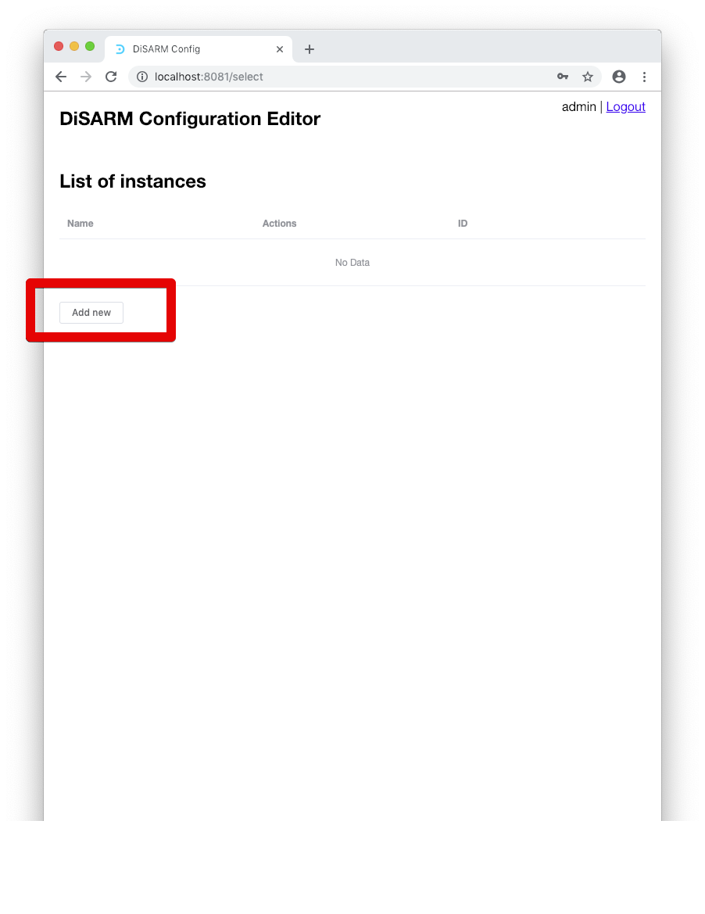
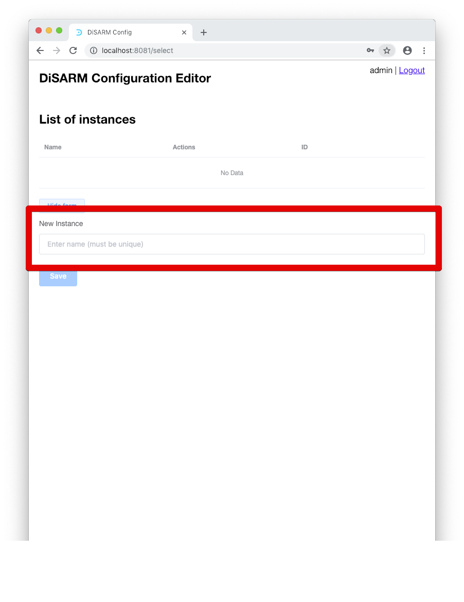
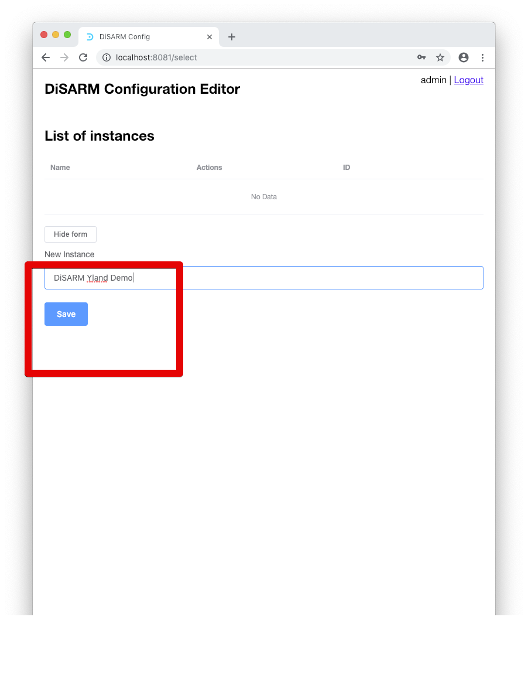
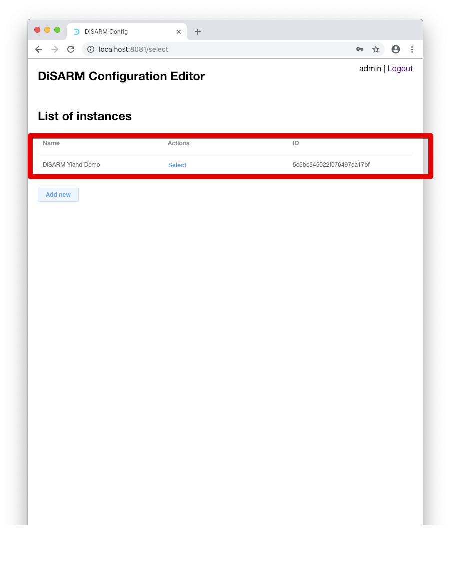
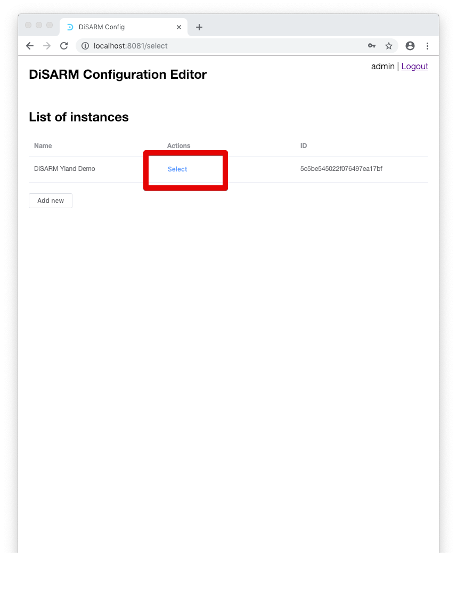
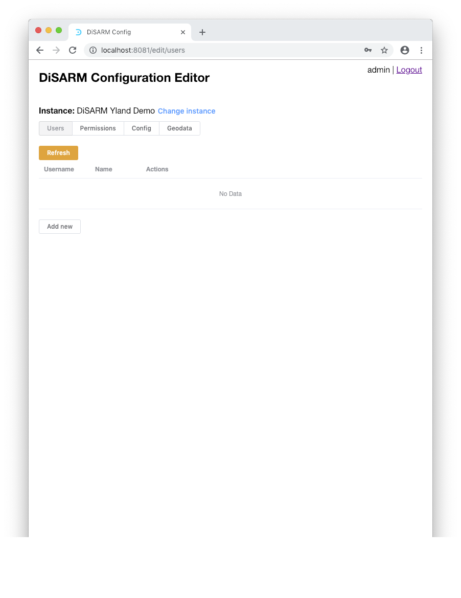

# Instances

**Create your DiSARM instance** 
1. To create a DiSARM instance the user must click the "add new" button as shown below

2. After clicking "add new" a text field labeled new instance will be shown and that is the user can enter the name of the instance.

3. The user can have a new instance by typing the name and clicking on save.

4. By doing so you should have a new instance in your list of instances and its ID which is generated automatically by the system.

5. If you have more than one instances they will all be shown in the table under the heading;"List of instances". At this stage the instance has only a name and an ID. It is missing users, their permission, configuration and last but not least, geodata. To add these you click on select in the middle colunm of the instance that you want to edit.

6. After selecting an instance, if it your first time opening it on the editor you should see a screen like the one shown below. It displays the name of your instance, a link to changinging the instance, and a menu of editions you can make in a tabs layout

