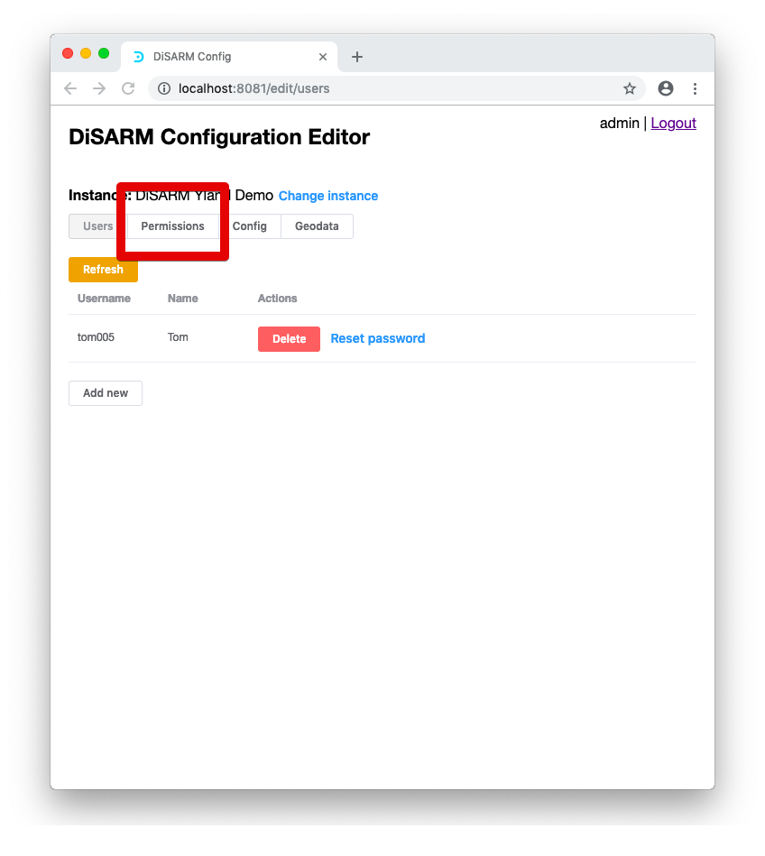
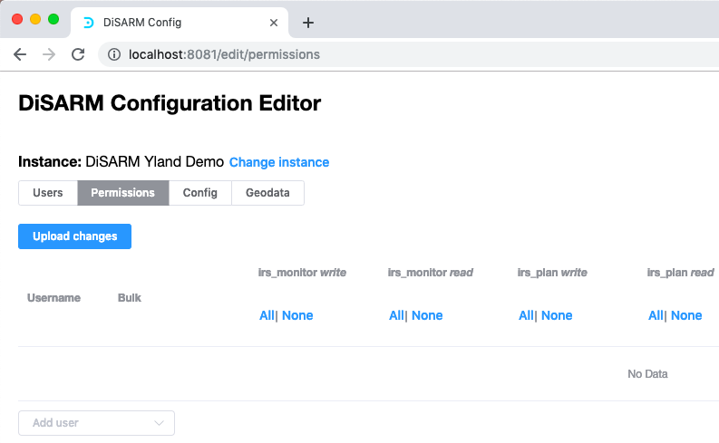
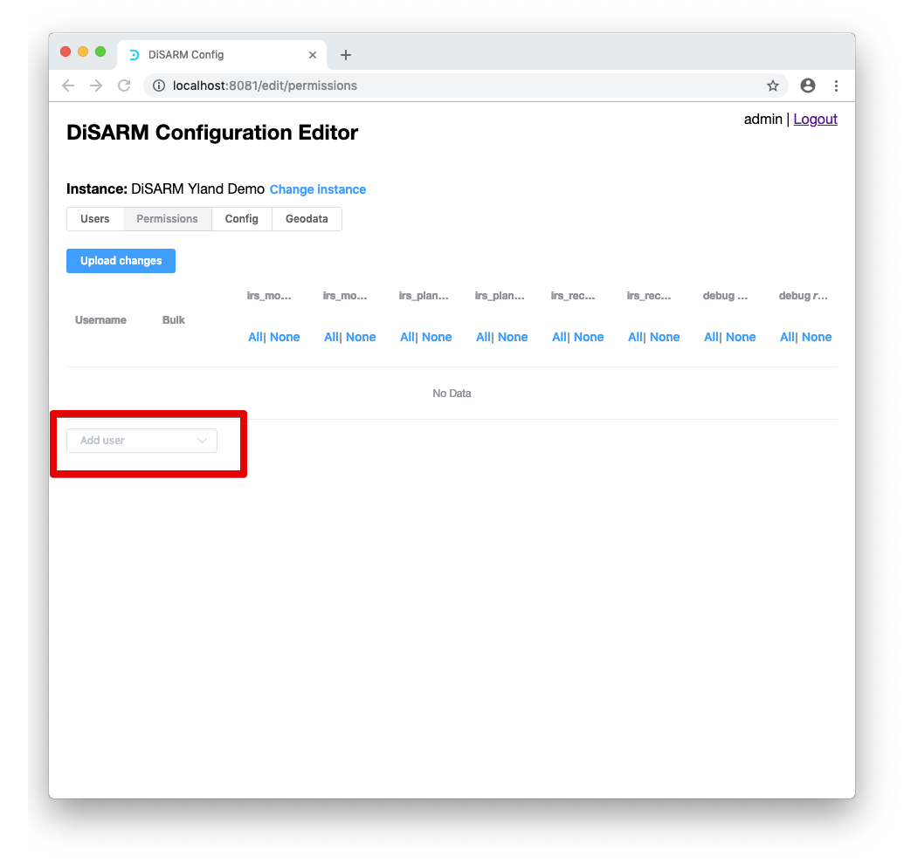
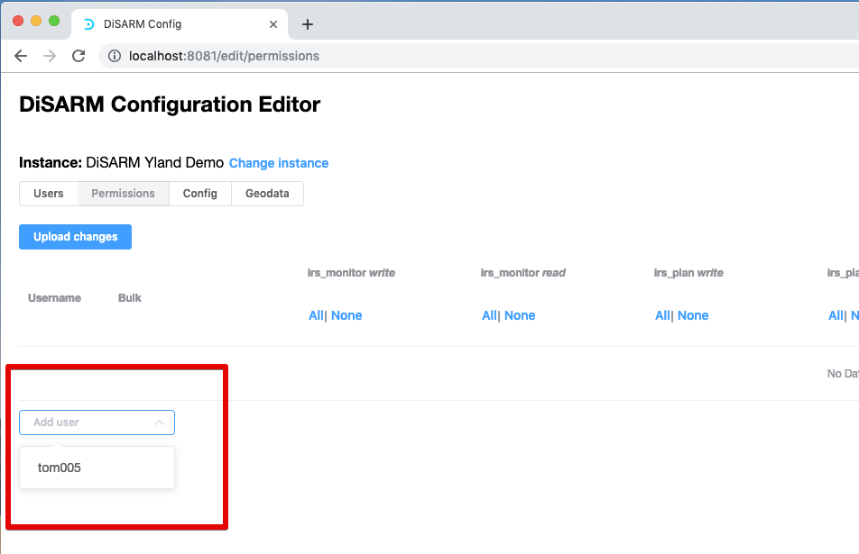
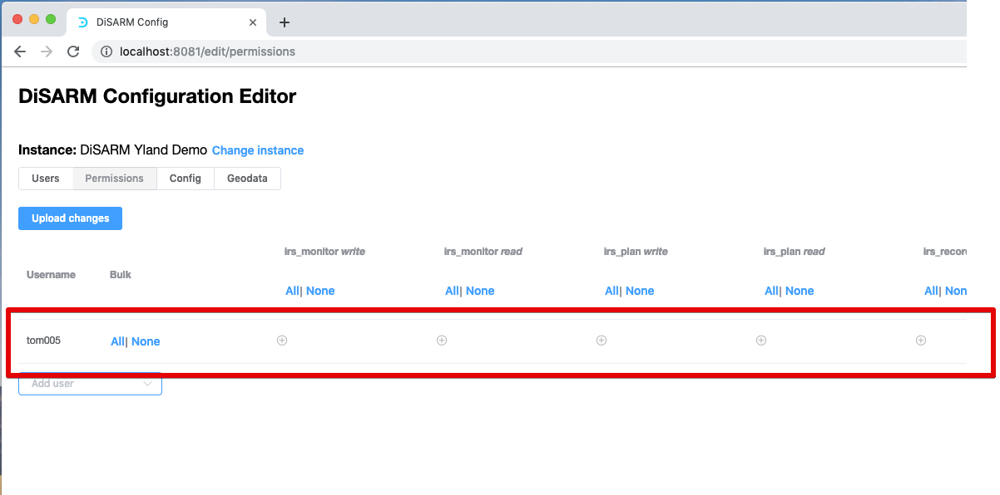
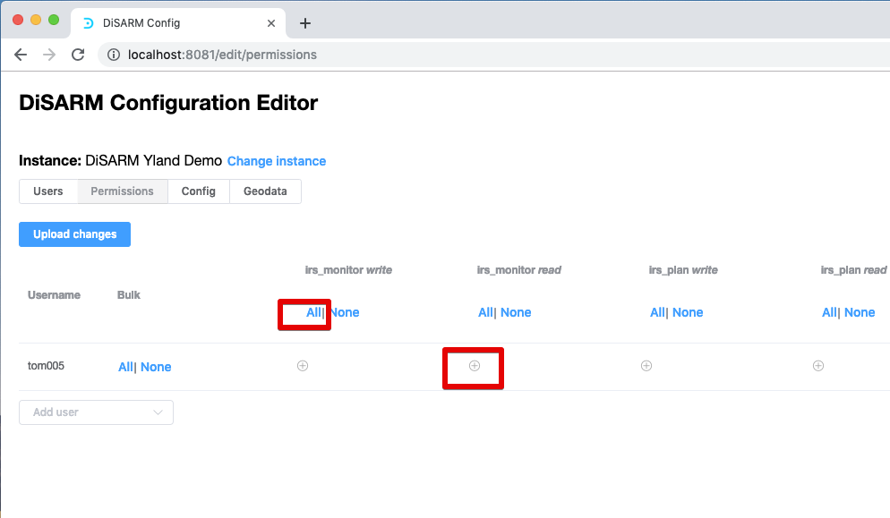
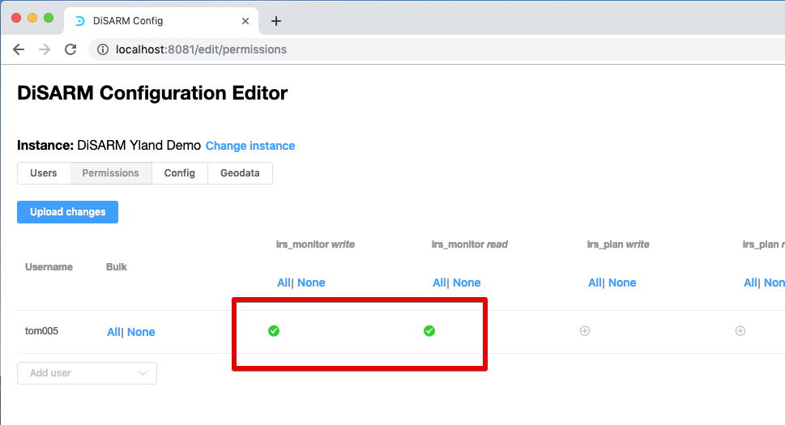
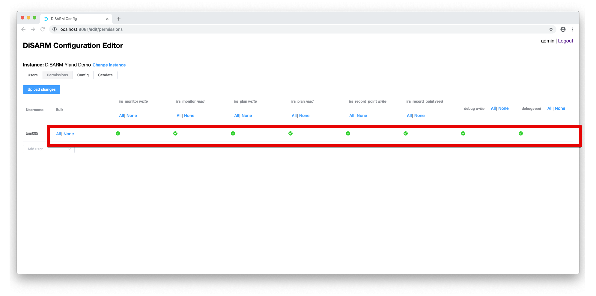
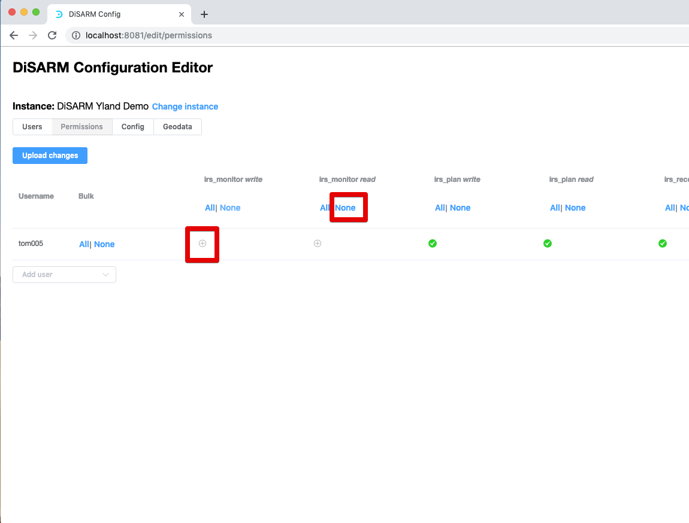
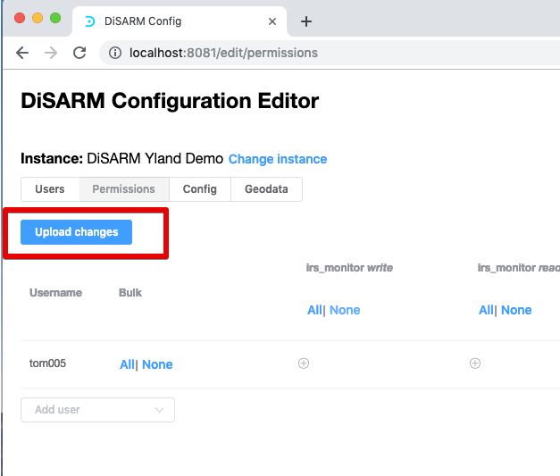

# Permissions

## View permissions
In this section of the application the administrator will be able to give permission to the users of the application. The applications is divided into sections called modules. It collects these modules\(sections\) from the configuration file written in section 3 of this document and displays them for the administrator to choose if a user can access that section or not.

1. To get to the permissions sections the option to be chosen on the main menu is the "permissions" as shown on the image below:

2. The next view will show the collection of all the modules that are defined in the config file. The image below shows how the view looks like:

4. As shown in the image there is a table with the columns being first the username, bulk, irs\_monitor write, irs\_monitor read, irs\_plan write, irs\_plan read, irs\_record\_point write, irs\_record\_point read, debug write, debug read. Next to each of these is all or none option which are used to define if user is given permission or not. The first thing to do though is to select a user that you want to give the permissions to by clicking on the button "add user" on the bottom left.

5. Once clicked the button will pop the list of all the users and the one to be given permissions should be selected by clicking on their name:

6. Since in this example on one user was made the pop list only shows the username of Tom which is tom005. Clicking on it should create a row on the table with plus signs under each column that can be clicked to give the user the permission presented in the header of that column.

7. The image below has two red rectangles on the items that can be clicked to grant permissions to the user. The items are the + sign and the text "All" just below that module that you want to grant permissions of.

8. After clicking the two items shown above the result should look as the one shown below:

> Note: the green checks/ticks mean that the user has access to the modules in which the ticks are in:

9. The bulk column can be used if you want to give a user all the permissions in just one click. To do that click on all under bulk and the whole row will be filled with green ticks showing the user has permissions to access every part of the application;

10. To remove permissions the text "None" is clicked the permissions are removed instantly. Another method is by clicking on the green tick and they will be removed and once again the ticks will turn into plus signs. Below the permissions are removed for irs\_monitor read\(by clicking on "None"\) and irs\_monitor write\(by clicking on the green tick\).

11. The last step is to click on upload changes to make sure that the settings you made are saved on your server and are applied to your users when they log in. to upload the changes click on the "Upload changes" button which is shown below:

