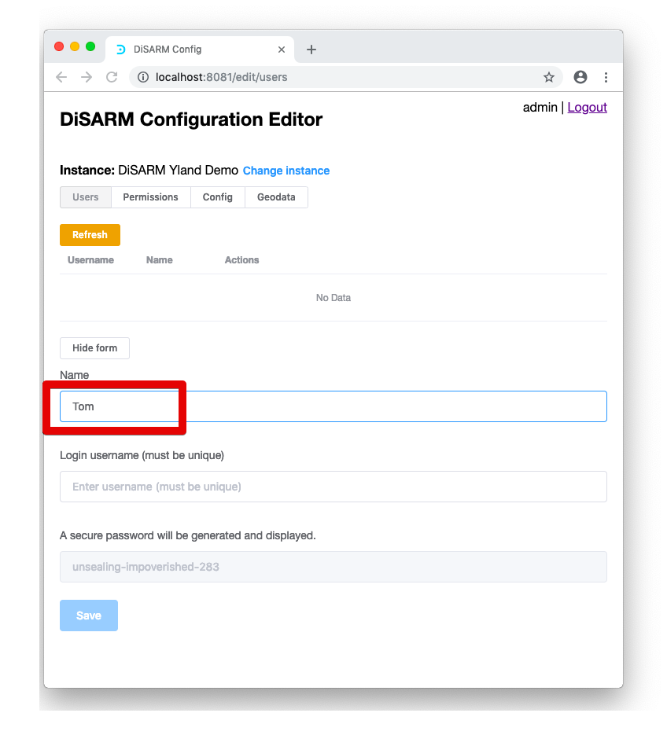
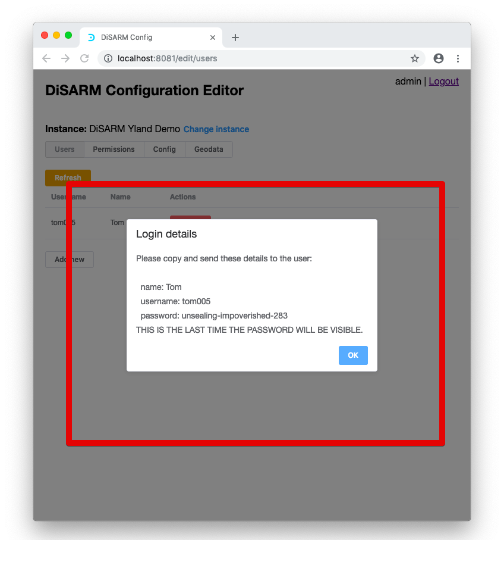
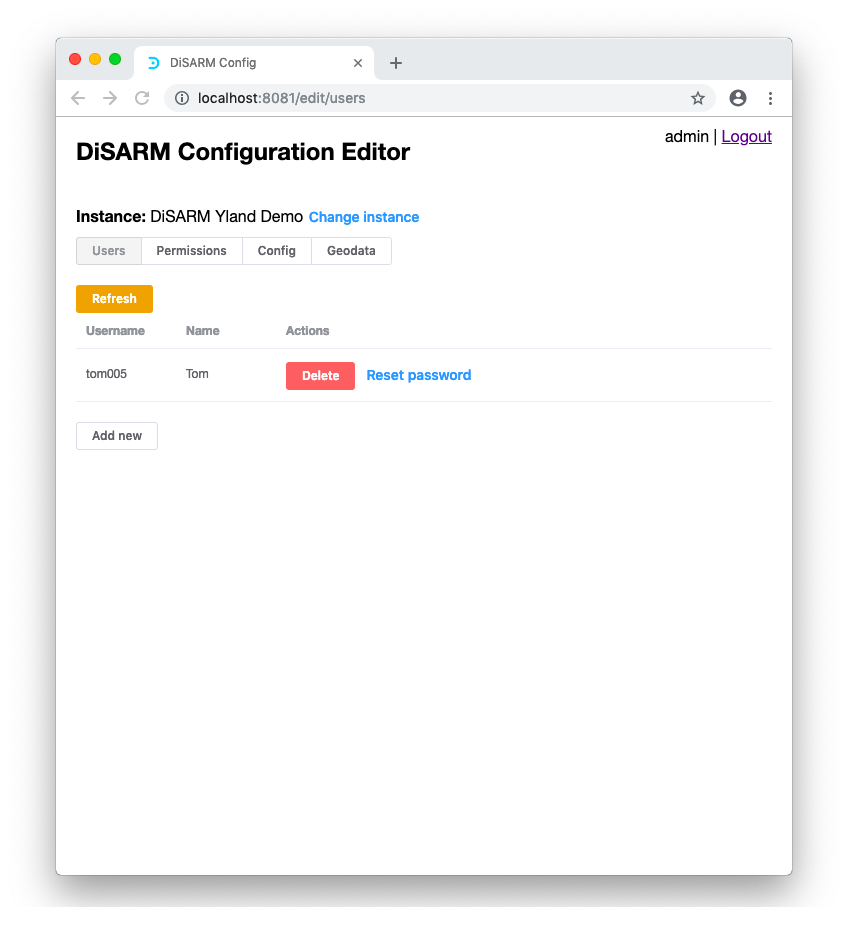
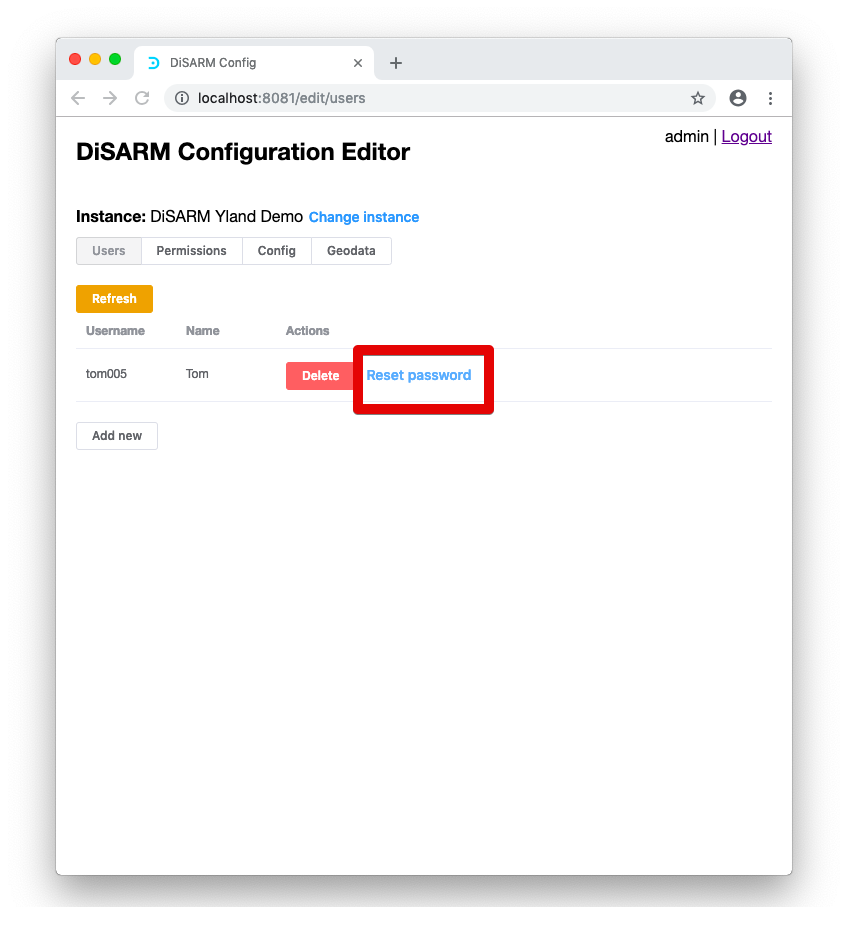
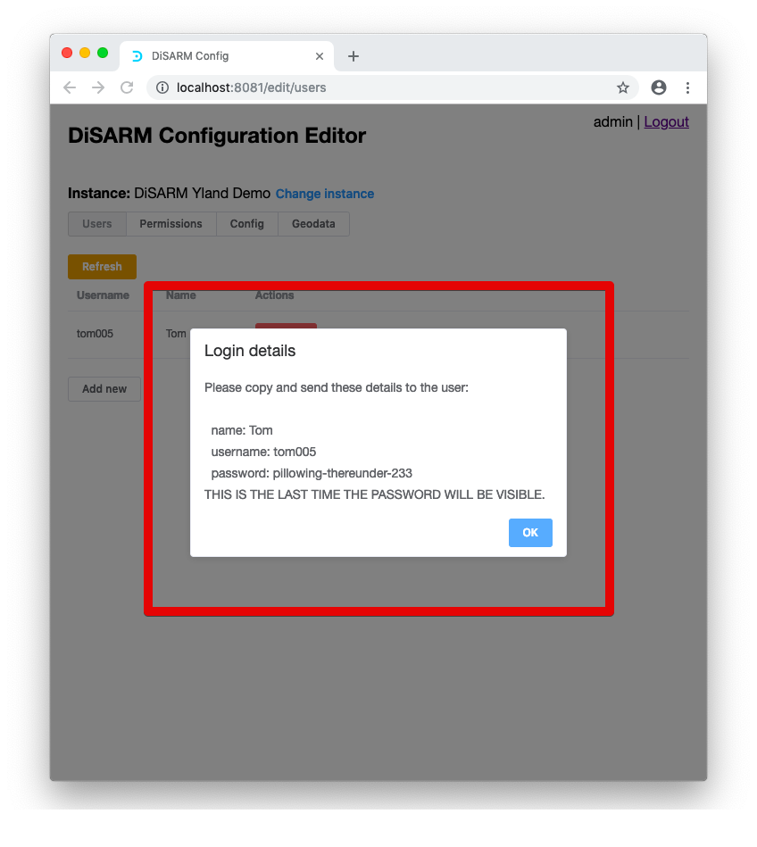

# Users

> To create the users who are going to use the application you must access the users part of the application. On this section of the application there is a form to fill in to create each and every user, giving them an ID, name and password. Permissions will be configured in a different part of the application.

To access the users section select the "users" option on the menu at the top of the page:

The image below shows the display that comes after clicking on users. The display shows an empty table that is supposed to list the users once they have been made. The actions column will show options that can be taken for user e.g. change password, delete user. To add the user the "add new" button shown below is clicked

## Adding new user

After clicking on "add new" a form is unveiled where the user can add the "name", "login" and "password"

The name does not need to be unique and it can be the real name of the user depending on your organisations rules. It should be inserted in the field marked red below:

For this example a user named tom will be added to the system, given a login of "tom005" and the password will be generated by the application. In the "name" field \(shown above\) the word tom will be inserted.

Inside the "login username" field the value will that will be inserted will be Tom005. The user may notice that the field already has the word "tom" in small letters inserted when the "name" field was deselected. To demonstrate that names may not be unique but users have the option to add numbers after the name we will just add "005" after the name. The image below demonstrates the addition of the "tom005" in the "login username" field:

> Note: the name and login username do not have to be the same

The next step is to click "save". The generated password will be copied in the next step to send to the user because after clicking save the user's information will be displayed on the screen in a pop up message.

The pop message discussed in the previous step is shown in the image below:

> Note: these details must be copied and pasted into another document so that the list of users and passwords is documented

If the user clicks OK on the pop shown then it goes back to the table that shows a list of all the users and the actions that can be taken in the management of user:

If more users are required the same steps listed above should be followed. Should a user forget their password it can be reset by clicking on the "reset password" button under the "actions" column.

When clicked the button will instantly delete the old password and generate a new, and pop up a message with the new password

The next session discusses how to give permissions to your users that have been created in this section.

